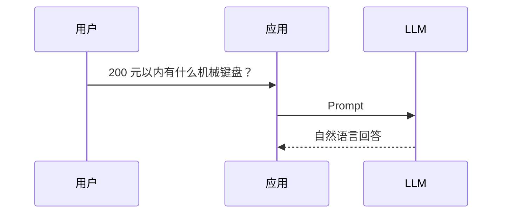
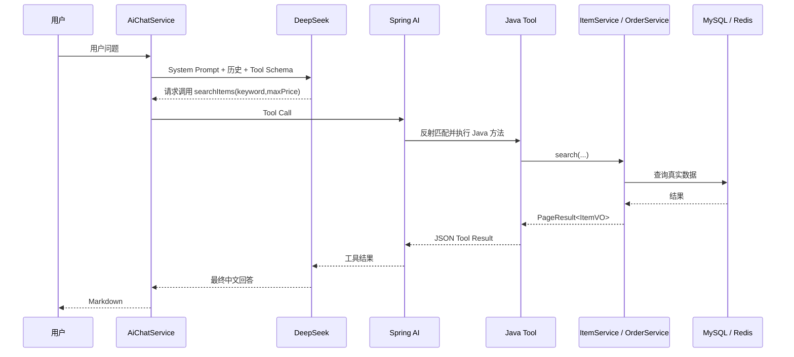

# Agent 与 Tool Calling

## 先区分普通 AI 调用

普通调用：



模型只能看到 Prompt 里的信息。若没有把真实商品数据放进上下文，它就可能：

- 编造商品。
- 给出过时价格。
- 不知道当前库存和商品状态。
- 无法区分当前登录用户的订单。

所以普通对话不适合实时业务查询。

## Agent 调用



这里“Agent”指的是模型可以在回答前决定调用一个或多个工具。它不是独立部署的 Agent 服务。

## “AI 怎么调用 Java？”

关键答案是：

> LLM 本身不会执行 Java。它根据 Tool Schema 生成一个结构化的 Tool Call，Spring AI 负责接收这个调用并执行匹配的 Java 方法，再把结果返回给 LLM。

完整机制：

1. `ChatClient.Builder.defaultTools(itemTools, orderTools)` 注册工具对象。
2. Spring AI 读取 `@Tool`、`@ToolParam` 和方法签名，生成模型可理解的 Tool Schema。
3. 模型拿到用户问题和 Schema，决定“不需要工具”或“调用某工具”。
4. 模型输出结构化名称和参数，例如：

```json
{
  "name": "searchItems",
  "arguments": {
    "keyword": "机械键盘",
    "maxPrice": 200,
    "page": 1,
    "size": 5
  }
}
```

5. Spring AI 找到 `ItemTools.searchItems`。
6. 参数按类型转换，并注入 `ToolContext`。
7. Java 方法调用 `ItemService.search`。
8. 返回的 JSON 作为 Tool Result 发回模型。
9. 模型生成最终自然语言回答。

执行权限仍在 Java 代码里。模型不能绕过 `ItemService` 直接写 SQL。

## Tool Schema

`@Tool` 的 `name` 和 `description` 告诉模型工具做什么。`@ToolParam` 描述参数。

示例：

```java
@Tool(name = "searchItems",
      description = "按关键词、分类、价格区间搜索当前正在出售的商品，返回分页商品列表")
public String searchItems(
        @ToolParam(required = false, description = "搜索关键词") String keyword,
        @ToolParam(required = false, description = "商品分类id") Long categoryId,
        @ToolParam(required = false, description = "最高价格") Double maxPrice,
        ...) {
}
```

Schema 主要告诉模型：

- 工具名。
- 什么时候适合使用。
- 参数名称、类型、是否必填和语义。

模型负责“填参数”，Spring AI 负责“执行”，Java 负责“权限和业务规则”。

## `searchItems`

真实位置：[`ItemTools.searchItems`](https://github.com/DoubleliuOne/campus-ai-market/blob/main/src/main/java/com/campusmarket/ai/tool/ItemTools.java)

### 模型可传参数

| 参数 | 类型 | 含义 |
| --- | --- | --- |
| `keyword` | String | 关键词 |
| `categoryId` | Long | 分类 id |
| `minPrice` | Double | 最低价格 |
| `maxPrice` | Double | 最高价格 |
| `page` | Integer | 页码 |
| `size` | Integer | 每页数量 |
| `toolContext` | ToolContext | 由框架注入，不由模型填写 |

### Java 内部行为

1. 检查 Tool 调用预算。
2. 默认 page 为 1，size 为 5。
3. size 最大限制为 20。
4. Double 转为 BigDecimal。
5. 固定按 `latest` 排序。
6. 调用 `ItemService.search`。
7. 成功返回 `PageResult<ItemVO>` JSON。
8. 业务异常返回可读错误文本。

因为使用 `ItemService.search`，AI 搜索同样可能使用 Redis 搜索缓存。

### 为什么返回字符串而不是对象

Spring AI Tool 的返回值最终要进入模型上下文，JSON 字符串是最容易稳定表达的格式。项目没有把 Entity 直接返回，而是返回已经组装好的 VO。

## `getItemDetail`

真实位置：`ItemTools.getItemDetail`

参数：

| 参数 | 必填 | 含义 |
| --- | --- | --- |
| `itemId` | 是 | 商品 id |
| `toolContext` | 框架注入 | 当前用户 |

行为：

1. 从 `ToolContext` 读取用户 id。
2. 构造 `LoginUser`。
3. 调用 `ItemService.getDetailForUser`。
4. 卖家可看自己所有状态商品，普通用户只能看 `ON_SALE`。
5. 序列化为 JSON。

因此 AI Tool 同样复用普通详情接口的权限规则。

## `getMyOrders`

真实位置：[`OrderTools.getMyOrders`](https://github.com/DoubleliuOne/campus-ai-market/blob/main/src/main/java/com/campusmarket/ai/tool/OrderTools.java)

参数：

| 参数 | 含义 |
| --- | --- |
| `role` | `buyer` 或 `seller`，默认 buyer |
| `toolContext` | 框架注入当前用户 |

关键安全设计：

- Tool 不接受模型传入 userId。
- 用户 id 来自 `AiChatService` 放入的 `ToolContext`。
- 模型即使被用户诱导提供别的 userId，也没有参数可以传。
- `OrderService.myOrders` 再按登录用户过滤。

调用：

```java
orderService.myOrders(new LoginUser(userId, null), role, 1, 20)
```

这里固定第一页 20 条，而不是让模型任意传入分页。

## `recommendItems`

真实位置：`ItemTools.recommendItems`

它不是一套新的推荐算法，而是“推荐意图 + 商品搜索”：

```text
keyword
categoryId
maxPrice
note
  -> searchItems(page=1, size=10)
  -> 把真实候选商品交给模型分析
```

参数 `note` 当前没有直接参与 SQL，只存在于工具描述和模型上下文。如果模型需要利用 note 排序，当前 Java 方法并没有实现语义推荐，只是模型看到候选结果后自行组织回答。

这一点在面试中必须说清楚：**当前推荐是 LLM 对真实搜索结果的重排和解释，不是向量召回或机器学习推荐系统。**

## ToolContext 怎么传用户身份

`AiChatService.chat`：

```java
Map<String, Object> toolContext = new HashMap<>();
toolContext.put("userId", loginUser.id());
toolContext.put("username", loginUser.username());
toolContext.put("toolCallBudget", new ToolCallBudget());

chatClient.prompt()
        .messages(messages)
        .toolContext(toolContext)
        .call()
        .content();
```

Tool 方法读取：

```java
Object userId = toolContext.getContext().get("userId");
```

ToolContext 是模型调用上下文和 Java 方法之间的安全侧信道。

## Tool Call 预算

`ToolCallBudget` 默认最多 6 次。

每次 Tool 方法开头：

```java
if (!hasBudget(toolContext)) {
    return "工具调用次数已达上限，请根据已有结果继续回答。";
}
```

作用：

- 防止模型反复调用同一工具。
- 限制外部请求时间。
- 控制 DeepSeek 调用轮次和成本。

它不是严格的安全沙箱，只是一种调用次数保护。

## System Prompt 的作用

`AiChatService` 构造 ChatClient 时写明：

- 商品必须调用 `searchItems`。
- 具体商品必须调用 `getItemDetail`。
- 自己订单必须调用 `getMyOrders`。
- 推荐必须调用 `recommendItems`。
- 缺失字段不能编造。
- 规则问题依据检索内容回答。
- 无商品时诚实说明。

Prompt 是行为约束，但不是绝对保证。Java 侧的权限和 Tool 预算才是硬约束。

## 商品详情上下文与 Tool 的区别

当请求带 `itemId`：

```text
后端先调用 ItemService.getDetailForUser
-> 把 ItemVO JSON 拼进当前 UserMessage
-> 模型直接获得当前商品上下文
```

这不是 Tool Calling，而是主动上下文注入。它适合“用户从商品详情页进入 AI”这一明确场景。

## 错误处理

Tool 内部捕获异常并返回字符串，让模型有机会解释：

```text
查询失败：商品不存在或已下架
工具调用次数已达上限，请根据已有结果继续回答。
商品搜索暂时不可用，请稍后重试。
```

AI 服务整体失败时：

- Tool 不能解决上游网络错误。
- `AiChatService.chat` 捕获运行时异常。
- 抛出 `ServiceUnavailableException`。
- `GlobalExceptionHandler` 返回 HTTP 503。

## 面试重点回答

### Agent 和普通聊天有什么区别？

> 普通聊天只把 Prompt 发给模型。Agent 在 Prompt 外提供 Tool Schema，让模型可以在回答前选择调用 Java 工具查询真实商品、订单或规则。项目最终回答会结合 Tool Result。

### AI 怎么调用 Java？

> LLM 只输出结构化 Tool Call，不能执行 Java。Spring AI 根据注册的 `@Tool` 元数据匹配方法，转换参数，注入 `ToolContext`，执行 Java 方法，把 JSON 结果返回模型。Token 中的用户身份通过 ToolContext 传进去，Tool 不接受模型提供 userId。

### 如何避免 AI 编造商品？

> System Prompt 强制商品问题调用工具，工具返回真实 MySQL 数据；没有结果时明确告诉模型。Prompt 降低概率，代码权限和数据查询保证数据来源，但不能保证模型永不表达错误，所以仍需评测和失败兜底。

### 如果模型传错参数怎么办？

> Spring AI 的类型转换和参数缺省逻辑会先处理，Java Tool 还对 page、size 和价格做边界处理。非法参数可能触发框架错误或返回可读失败。生产级方案还应加入参数 Schema 校验、工具调用日志和重试策略。

继续阅读：[多轮会话与用户隔离](./conversation.md)。
