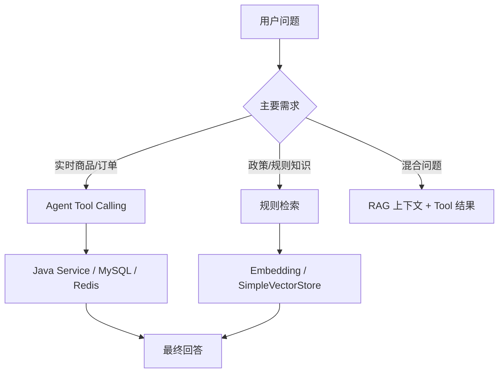

# Agent 与 RAG 对比

## 核心区别

| 维度 | Agent / Tool Calling | RAG |
| --- | --- | --- |
| 解决什么 | 让模型调用实时业务能力 | 给模型补充私有知识 |
| 数据是否实时 | 是，调用 Service 和数据库 | 否，依赖预先构建的知识库 |
| 工具/数据形态 | Java 方法 + JSON Tool Result | 文本段落 + 向量检索 |
| 是否写数据 | 当前 Tool 只读，不写业务 | 不写业务 |
| 是否依赖提示词 | 依赖工具选择，但最终由框架调用 Java | 依赖检索和 Prompt 注入 |
| 项目场景 | 商品、详情、订单、推荐 | 禁售、发布、交易、退款规则 |

## 场景对比

| 场景 | 为什么用 Agent | 为什么不用 RAG |
| --- | --- | --- |
| 查询商品 | 需要实时状态、价格和分页数据 | 商品变化频繁，不适合预先生成静态向量 |
| 查询订单 | 必须按当前 JWT 用户隔离 | 订单是私有实时数据，向量库不适合精确权限查询 |
| 查询校园规则 | 规则问题不需要执行 Java 业务方法 | 规则稳定、文字型、适合检索上下文 |

反过来：

- 规则问题不需要 `OrderTools`，因为规则文档并不在订单表。
- 商品问题不应该只靠 RAG，因为向量库不会实时更新 MySQL 商品状态。
- 订单问题不应该把订单内容放进公共向量库。

## 项目什么时候使用 Agent

当用户问题需要访问真实业务状态：

- “200 元以内有什么机械键盘？”
- “商品 5 的成色怎么样？”
- “我最近的订单是什么？”
- “推荐适合宿舍的商品。”

这时模型应选择 Tool。

## 项目什么时候使用 RAG

当问题涉及平台规则：

- “平台不能发布什么？”
- “退款规则是什么？”
- “交易要注意什么？”

`KnowledgeBaseService.isRuleQuestion` 通过关键词命中后执行检索。

## 两者能不能同时使用

可以，但当前代码在一次 AI 请求中可能同时发生：

```text
buildItemContext
  -> 规则关键词命中
  -> retrieveRules(message)
  -> 把规则加入当前 UserMessage

ChatClient
  -> 模型同时看到规则上下文和 Tool Schema
  -> 如果问题还需要实时业务数据，再调用 Tool
```

例如：

> “平台允许卖教材吗，顺便帮我找 50 元以内的教材。”

理论上可以：

1. RAG 检索“可发布商品”和“平台禁售规则”。
2. Agent 调用 `searchItems` 查教材。
3. 模型组合规则和商品结果回答。

当前 System Prompt 和关键词门控支持这种组合，但没有针对混合问题做专门测试。

## 为什么不把所有信息都放 Prompt

因为数据性质不同：

- 商品和订单数据量大、实时变化、需要权限。
- 规则知识稳定、文本短、需要语义检索。
- Prompt 有 Token 上限和成本。
- 订单不能作为公共向量知识泄露给其他用户。

## 为什么同时使用

> 因为两类问题的数据形态和查询要求不同。商品、订单需要实时、精确和用户隔离，适合 Tool Calling 调用 Service；交易规则是稳定文本知识，适合 Embedding 检索。当前项目让 Agent 处理“查业务”，让 RAG 处理“查规则”，必要时可在同一轮请求里组合。

## 面试官可能质疑

### 这算真正的 Agent 吗？

> 它属于工具型 Agent 的最小实现。模型可以自主决定是否调用预注册工具，并基于工具结果继续生成。它没有规划器、长期记忆 Agent、多个自主子任务或 MCP，但超过了普通单次聊天。

### 为什么不让 RAG 也回答商品？

> 商品实时变化并有权限和状态，向量库可能出现旧价格、已售商品或越权数据。Tool 直接调用 Service/MySQL 能保持实时性和权限边界。

### 为什么不把规则直接写进 System Prompt？

> 规则会变，全文加入每次都消耗 Token。RAG 按问题检索相关段落，便于维护和扩展。当前规则只有 5 段，写进 Prompt 也不是不能工作，但工程上可学习性和扩展性较差。

## 设计矩阵



继续阅读：[Vue 前端源码学习](./frontend.md)。
