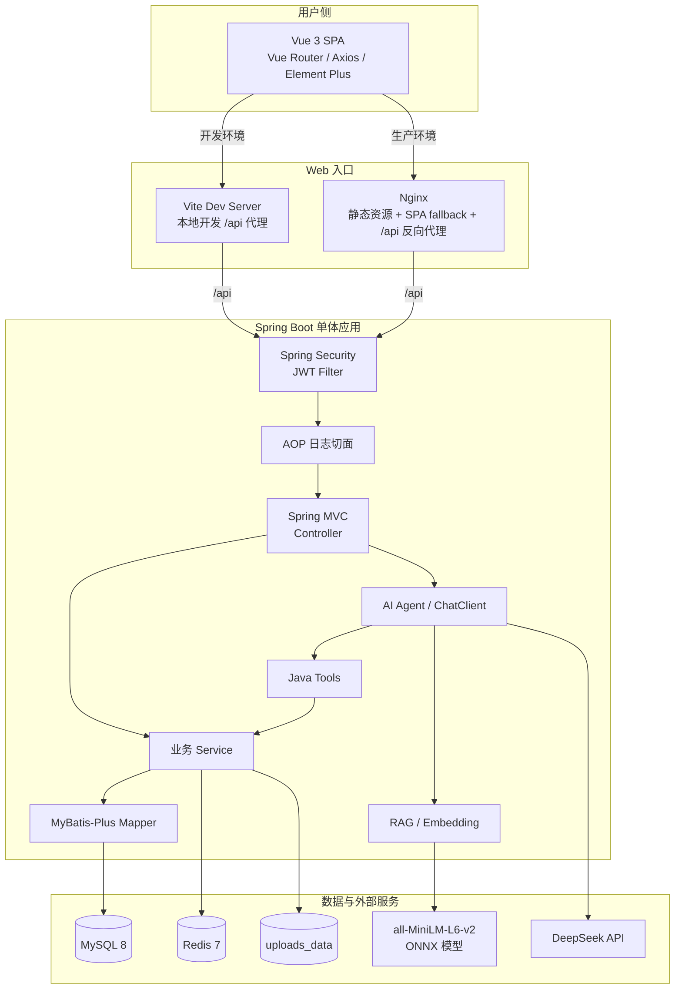
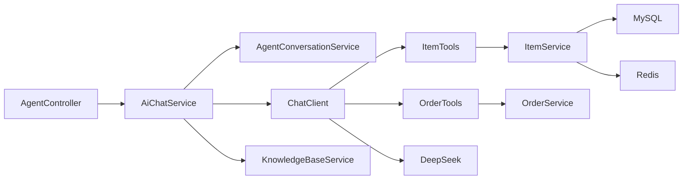
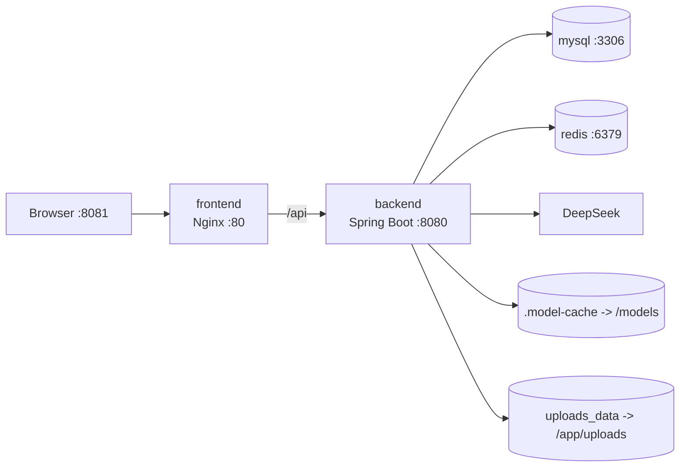

# 系统整体架构

## 架构图



## 为什么要分层

整体架构可以按“变化的来源”理解：

| 层 | 主要变化 | 项目职责 |
| --- | --- | --- |
| Vue | 页面、交互和展示 | 收集输入、调用 API、管理页面状态 |
| Nginx / Vite | 访问路径和部署方式 | 静态资源、SPA 回退、`/api` 代理 |
| Security | 谁能访问 | JWT 校验、放行公开接口 |
| Controller | HTTP 契约 | 路由、参数校验、调用 Service |
| Service | 业务规则 | 权限、状态、事务、缓存和组合查询 |
| Mapper | 数据访问 | CRUD、分页、自定义 SQL |
| MySQL | 持久事实 | 用户、商品、订单、会话 |
| Redis | 临时状态与加速 | 黑名单、缓存和版本号 |
| AI | 自然语言能力 | Tool Calling、会话、规则检索 |

## 前后端怎么通信

本地开发时：

```text
浏览器 http://127.0.0.1:5173
  -> Vue /api/items
  -> Vite proxy
  -> http://localhost:8080/api/items
```

Docker 环境：

```text
浏览器 http://localhost:8081
  -> Nginx /api/items
  -> http://backend:8080/api/items
```

前端不直接连接 MySQL、Redis、DeepSeek 或 Embedding 模型。所有业务能力都经过 Spring Boot API。

## AI 在系统中的位置

AI 不是独立微服务，而是 Spring Boot 进程中的业务能力：



这种设计有两个直接结果：

1. AI Tool 可以复用普通业务的 Service 权限和查询逻辑。
2. AI 故障不会阻止普通交易接口运行；后端仍能启动，只是 AI 接口返回不可用。

## 同步请求模型

当前项目主要使用同步请求模型：

- 浏览器等待 HTTP 响应。
- Spring MVC 在线程内执行 Controller、Service、Mapper。
- AI 请求也同步等待 DeepSeek 和 Tool 调用完成。

没有使用消息队列、WebSocket 或流式 SSE。因此：

- AI 首次回答可能较慢。
- Nginx 的 `proxy_read_timeout` 配置为 300 秒。
- 前端 Axios 超时配置为 60 秒。

这两个超时数值不同，实际网络较慢时仍可能由 Axios 先超时。

## 数据一致性边界

### 强一致部分

- 订单创建和商品 `ON_SALE -> SOLD` 使用同一事务。
- 行锁和条件更新避免并发重复下单。
- 订单状态更新采用“当前状态 + 条件更新”避免状态覆盖。

### 最终一致或可降级部分

- Redis 热门缓存只在写操作时删除，读取时重新生成。
- 搜索缓存使用版本号，旧版本键不立即删除，而是等待 TTL。
- Redis 不可用时缓存和黑名单暂时失效。

## 部署拓扑



Compose 中的 `depends_on` 同时使用健康检查条件：

- backend 等 MySQL 和 Redis healthy
- frontend 等 backend healthy

这比只写 `depends_on` 更适合当前系统，因为后端启动时需要数据库和 Redis 客户端配置可用。

## 面试回答

### 你的项目整体架构是什么？

> 前端是 Vue 3 SPA，本地由 Vite 代理 `/api`，Docker 中由 Nginx 托管静态资源并反向代理到 Spring Boot。后端是单体分层架构，Spring Security 先做 JWT 鉴权，Controller 负责接口，Service 处理业务和事务，MyBatis-Plus 访问 MySQL，Redis 用于黑名单和缓存。AI 通过 Spring AI 的 ChatClient 调用 DeepSeek，模型可 Tool Calling 到 Java 商品和订单工具，规则问题则由本地 Embedding 和 SimpleVectorStore 提供检索上下文。

### 前端和后端怎么通信？

> 前端所有请求统一经过 `http.js` 的 Axios 实例，Base URL 是 `/api`，请求拦截器自动带 Bearer Token。开发环境用 Vite proxy，生产环境用 Nginx `/api` location 转发到 `backend:8080`。响应统一是 `{code,message,data}`，Axios 响应拦截器只把 `data` 返回给业务代码。

### AI 在系统什么位置？

> AI 是 Spring Boot 内的业务能力，不是绕过业务层直接访问数据库的独立服务。ChatClient 注册的 Tool 最终调用 ItemService 和 OrderService，所以 AI 查询与普通接口共享业务规则和数据访问层。

继续阅读：[目录与知识地图](./directory-map.md)。
