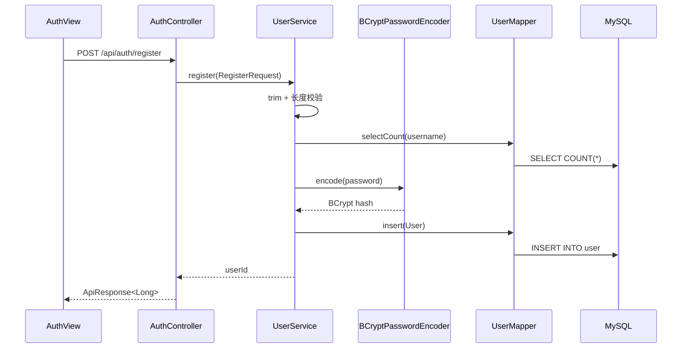
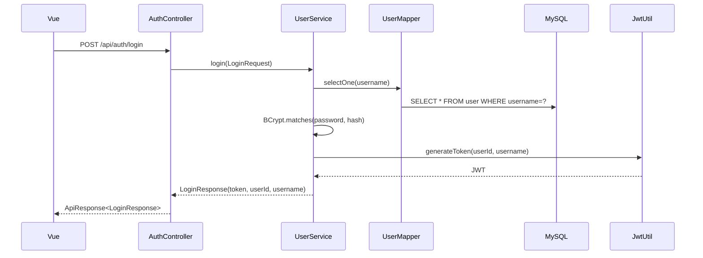
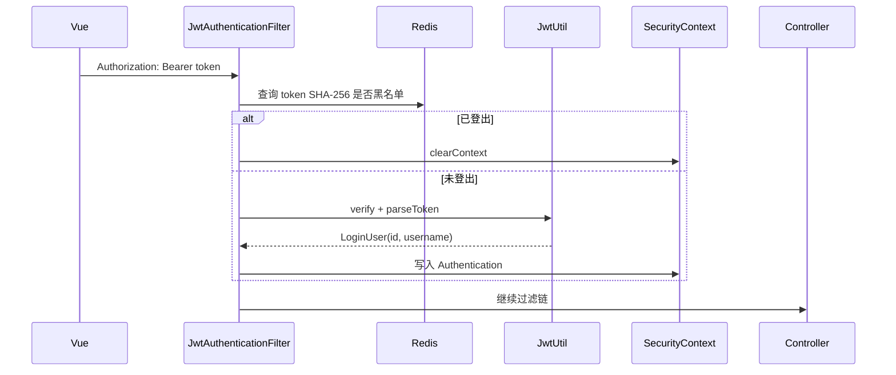
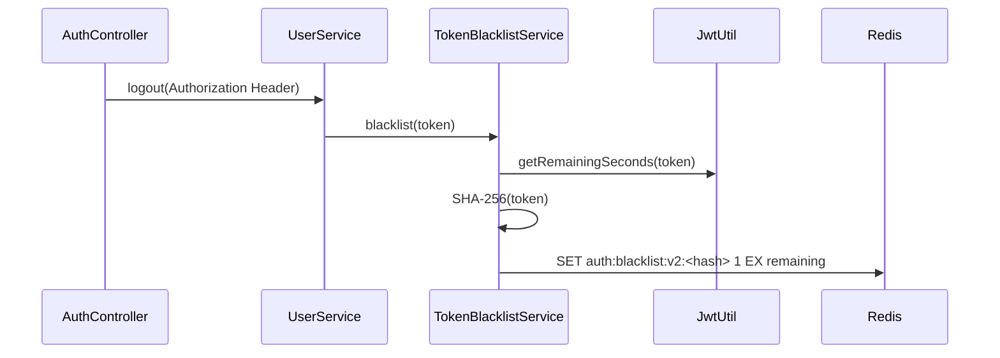

# 登录、JWT 与 Security

## 认证与鉴权区别

- **认证**：你是谁。项目通过用户名、密码和 JWT 识别用户。
- **鉴权**：你能不能访问某个资源。项目通过 `SecurityConfig` 和 Service 所有者校验判断权限。

前端隐藏按钮只能改善体验，不能代替后端检查。

## 注册链路



真实代码：

- [`AuthController.register`](https://github.com/DoubleliuOne/campus-ai-market/blob/main/src/main/java/com/campusmarket/controller/AuthController.java)
- [`UserService.register`](https://github.com/DoubleliuOne/campus-ai-market/blob/main/src/main/java/com/campusmarket/service/UserService.java)
- [`AppConfig.passwordEncoder`](https://github.com/DoubleliuOne/campus-ai-market/blob/main/src/main/java/com/campusmarket/config/AppConfig.java)

### BCrypt 解决什么

BCrypt 是带随机盐的自适应单向哈希：

- 数据库只保存哈希，不保存明文密码。
- 同一密码每次哈希结果不同。
- 登录用 `matches` 比对，不需要解密。
- 计算成本可调，比普通 MD5/SHA 慢，降低暴力破解速度。

`user.password_hash` 长度设置为 100，足以保存当前 BCrypt 结果。

## 登录链路



登录失败时，用户不存在和密码错误统一返回“用户名或密码错误”，避免泄露用户是否存在。

## JWT 结构

JWT 形如：

```text
header.payload.signature
```

### Header

描述签名算法等元数据。`java-jwt` 会根据 `Algorithm.HMAC256` 生成对应头部。

### Payload

项目写入：

| Claim | 值 |
| --- | --- |
| `sub` | 用户 id 字符串 |
| `username` | 用户名 |
| `iat` | 签发时间 |
| `exp` | 过期时间 |

Payload 只是 Base64URL 编码，不是加密。不要把密码、身份证等敏感数据放入 JWT。

### Signature

使用服务端 `jwt.secret` 和 HMAC-SHA256 生成。服务端再次验签时使用同一密钥。攻击者修改 Payload 后，没有密钥就无法生成有效签名。

`JwtUtil` 构造时要求密钥至少 32 字节，过期分钟数必须为正。

## JWT 为什么不需要服务器 Session

传统 Session 方案中，服务器保存 Session 数据，浏览器只保存 Session ID。JWT 方案把用户 id、用户名和过期时间编码在 Token 中，服务端验签后即可得到身份。

项目还用 Spring Security 的 `SessionCreationPolicy.STATELESS` 明确关闭服务端 Session。

优点：

- 服务端无需为每个登录用户维护 Session。
- 适合前后端分离和水平扩展。
- API 可通过 Authorization Header 携带身份。

缺点：

- Token 一旦签发，在过期前天然有效。
- 无法仅靠 JWT 主动撤销。
- Token 体积通常大于 Session ID。
- 需要额外机制处理登出和封禁。

## 后续请求的验证过程



真实代码：

- [`JwtAuthenticationFilter`](https://github.com/DoubleliuOne/campus-ai-market/blob/main/src/main/java/com/campusmarket/security/JwtAuthenticationFilter.java)
- [`SecurityConfig`](https://github.com/DoubleliuOne/campus-ai-market/blob/main/src/main/java/com/campusmarket/security/SecurityConfig.java)

Controller 通过以下方式获取用户：

```java
@AuthenticationPrincipal LoginUser loginUser
```

## 公开接口与受保护接口

`SecurityConfig` 的规则顺序很重要：

1. `/error` 公开。
2. Swagger 和 OpenAPI 公开。
3. 注册、登录公开。
4. GET 分类公开。
5. GET 上传图片公开。
6. `/api/items/mine` 和 `/api/items/*/manage` 要求认证。
7. GET `/api/items` 和 `/api/items/**` 公开。
8. 其他请求要求认证。

第 6 条必须排在第 7 条前，否则 `/api/items/mine` 可能被 `/api/items/**` 的公开规则提前放行。

## 登出与 Redis 黑名单



Key：

```text
auth:blacklist:v2:<sha256(token)>
```

Value：

```text
1
```

TTL：Token 剩余有效期。

使用摘要而不是完整 Token：

- 避免 Redis Key 过长。
- 降低运维界面或日志泄露完整 Token 的风险。
- 查询结果等价，因为同一 Token 摘要唯一。

## Token 过期怎么办

`JWT.require(algorithm).verify(token)` 会检查 `exp`。过期后验签或验证失败，Filter 不写入认证信息，受保护请求由 EntryPoint 返回 401。前端 Axios 清理本地会话并跳转登录页。

当前项目没有 Refresh Token。用户需要重新登录。

## Redis 挂了怎么办

`JwtAuthenticationFilter` 对黑名单查询捕获 `RuntimeException`：

- 查询失败时按“未被拉黑”继续。
- 然后仍执行 JWT 签名和过期校验。

这是可用性优先的降级：

- 普通合法请求不会被 Redis 故障全部打成 401。
- 已登出的 Token 在 Redis 恢复前可能重新可用。

面试时应主动承认这个安全权衡，而不是把降级说成完全没有问题。

## 前后端 Token 生命周期

前端 `http.js`：

- 登录成功后把 Token 和用户信息写入 `localStorage`。
- 请求拦截器自动加 `Authorization`。
- 401 时清理会话。

`auth.js`：

- 启动时调用 `/api/auth/me` 恢复会话。
- 登出无论后端是否成功，都清理本地会话。

## 面试题库

### 为什么使用 JWT？

> 项目是前后端分离 API，JWT 可以让身份信息随请求传递，服务端不需要保存 Session。Spring Security 使用无状态策略，每个请求通过 Filter 验签并构建 Authentication。

### JWT 是安全的吗？

> JWT 不是加密的，Payload 可被 Base64URL 解码。安全性来自签名和服务端密钥保护，所以不能放敏感数据。项目还限制密钥至少 32 字节，并通过 HTTPS 传输的生产要求应由部署层保证。

### 为什么登出还需要 Redis？

> JWT 本身在过期前一直有效，服务端无法直接撤回。项目在登出时把 Token SHA-256 写入 Redis，TTL 等于 Token 剩余时间。后续 Filter 先查黑名单，因此已登出的 Token 会被拒绝。

### Redis 故障时黑名单失效怎么办？

> 当前策略是记录日志式降级，继续依赖 JWT 签名验证，保证普通业务可用，但已登出 Token 会暂时重新可用。生产中可以用 Redis 高可用、短期 Token、Refresh Token 或带版本的会话状态减少窗口。

继续阅读：[MySQL 与 MyBatis-Plus](./database-mybatis.md)。
