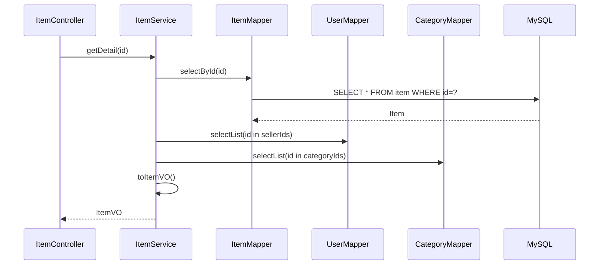

# Controller / Service / Mapper 分层

## 完整分层

```text
HTTP Request
  -> Controller
  -> Service
  -> Mapper
  -> MyBatis-Plus
  -> JDBC Driver
  -> MySQL
  -> Entity / VO
  -> ApiResponse
  -> JSON
```

项目标准路径：

```text
Controller -> Service -> Mapper -> MySQL
Controller -> Service -> Redis
Controller -> Service -> VO -> ApiResponse
```

## Controller 为什么存在

Controller 负责 HTTP 协议边界：

- 映射路径和方法。
- 接收 Path、Query、Body、Header。
- 使用 `@Valid` 触发参数校验。
- 获取 `@AuthenticationPrincipal LoginUser`。
- 调用 Service。
- 包装 `ApiResponse`。

真实例子：

[`ItemController.java`](https://github.com/DoubleliuOne/campus-ai-market/blob/main/src/main/java/com/campusmarket/controller/ItemController.java)

```java
@PostMapping
public ApiResponse<Long> create(@Valid @RequestBody CreateItemRequest request,
                                @AuthenticationPrincipal LoginUser loginUser) {
    return ApiResponse.ok(itemService.publish(request, loginUser));
}
```

Controller 不需要知道图片 JSON 怎么处理、分类是否存在或缓存如何失效。

## Service 为什么存在

Service 负责业务规则和组合操作：

- 权限判断，例如商品只能由卖家修改。
- 多表组合，例如 `ItemVO` 需要卖家和分类信息。
- 状态检查，例如订单是否可以转换。
- 事务边界，例如创建订单和商品变已售。
- 缓存，例如搜索后写 Redis。
- 外部能力，例如 AI 和文件存储。

真实例子：

[`OrderService.java`](https://github.com/DoubleliuOne/campus-ai-market/blob/main/src/main/java/com/campusmarket/service/OrderService.java)

创建订单不是简单 `orderMapper.insert`，它同时检查卖家、锁商品、更新商品状态、创建订单并安排缓存失效。

## Mapper 为什么存在

Mapper 负责数据访问。项目大多使用 MyBatis-Plus `BaseMapper`：

```java
public interface UserMapper extends BaseMapper<User> {
}
```

Service 可以调用：

```text
selectById
selectOne
selectCount
selectList
selectPage
insert
update
delete
```

自定义 SQL 只在需要明确语法或并发控制时添加，例如：

```sql
SELECT * FROM item WHERE id = #{id} FOR UPDATE
```

## Entity 是什么

Entity 与数据库表结构对应：

```text
Item Entity
  -> @TableName("item")
  -> id, sellerId, categoryId, title, description, price, images, status
```

Entity 适合 MyBatis-Plus 做 CRUD，不适合直接返回前端，原因包括：

- 可能包含密码哈希等敏感字段。
- 字段名面向数据库，不一定满足页面展示。
- 单个表无法提供关联用户名、分类名等组合字段。
- 直接暴露表结构会耦合 API 契约和数据库结构。

## DTO 是什么

DTO 是请求数据对象，例如：

- `CreateItemRequest`
- `CreateOrderRequest`
- `AgentChatRequest`

DTO 隔离 HTTP 输入与 Entity。前端不一定需要传 Entity 的所有字段，例如发布商品时不能传 `sellerId` 和 `status`，这些由后端根据当前用户和规则决定。

## VO 是什么

VO 是接口响应对象。例如 `ItemVO` 组合了：

```text
item.id
item.seller_id + user.username
item.category_id + category.name
item.title/description/price/images/status/create_time
```

这就是为什么 `ItemService.toItemVOs` 会先批量查用户和分类，再手工组装 VO。

## 为什么不能全写在 Controller

如果所有逻辑都写在 Controller：

1. 多个入口复用困难，例如普通商品搜索和 AI Tool 都要搜索商品。
2. 事务边界不清楚。
3. HTTP 对象与业务逻辑耦合，无法方便测试。
4. 权限和状态规则容易在不同接口重复或遗漏。
5. 缓存失效和组合查询散落。

项目的 `ItemTools.searchItems` 直接调用 `ItemService.search`，证明分层带来复用价值。

## 一个真实商品详情查询



单个商品详情实际最多可能查三次数据库。这里选择可读性优先，没有使用 JOIN。批量商品列表会去重 seller/category id 后批量查询，避免 N+1。

## 异常如何跨层

- Controller：参数校验异常由 Spring MVC 抛出。
- Service：业务不满足时抛 `BusinessException`。
- AI 不可用：抛 `ServiceUnavailableException`。
- `GlobalExceptionHandler`：统一转换为 `ApiResponse` 和 HTTP 状态码。

Service 不直接构造 HTTP 响应，这也是分层边界的体现。

## 面试回答

### 为什么有 Entity、DTO、VO 三种对象？

> Entity 面向上数据库，DTO 面向前端输入，VO 面向接口输出。它们职责不同。比如密码哈希只在 User Entity 中，不能暴露；ItemVO 需要 sellerUsername 和 categoryName，这两个字段来自其他表，也不适合塞进 Item Entity。

### Controller 应不应该写业务？

> 不应写核心业务。Controller 应只做协议适配、校验和调用 Service。否则权限、事务和缓存会在不同接口重复，AI Tool 也无法复用。

### Mapper 可以返回 VO 吗？

> 可以，当复杂 JOIN 或聚合查询更适合一条 SQL 时可以直接返回 VO。当前 AI 会话分页就是这样，`AiConversationMapper` 直接查询 `ConversationVO`。普通 CRUD 仍以 Entity 为主。

继续阅读：[登录、JWT 与 Security](./auth-jwt-security.md)。
