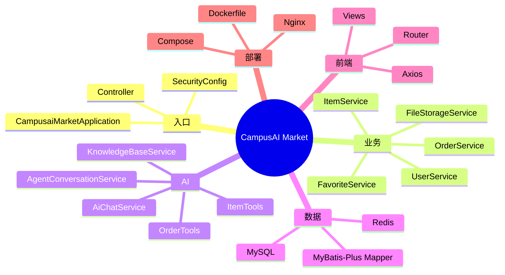

# 完成检查与当前状态

## 项目学习文档完成情况

- [x] 已读取 GitHub 当前 `main` 分支对应的本地完整仓库。
- [x] 已确认本地 HEAD 与 `origin/main` 一致：`b3c73f1`。
- [x] 已分析后端 Controller、Service、Mapper、Entity、DTO、VO、Security、AI、RAG 和测试。
- [x] 已分析 Vue 入口、Axios、路由、状态、布局和全部主要页面。
- [x] 已分析 MySQL 表结构、外键、索引和增量迁移。
- [x] 已分析 Token 黑名单、热门缓存、搜索缓存和数据一致性。
- [x] 已分析订单状态机、事务和防并发超卖。
- [x] 已分析图片上传安全与 Docker Volume。
- [x] 已分析 Tool Calling、ToolContext、四个 Tool 和调用预算。
- [x] 已分析 conversation/message、多轮上下文和用户隔离。
- [x] 已分析 Embedding、SimpleVectorStore、Top 3 和 RAG 降级。
- [x] 已分析 Dockerfile、Compose、Nginx、Network、Volume 和健康检查。
- [x] 已建立六大完整业务链路。
- [x] 已建立面试题库、追问树、质疑清单和十二阶段学习路线。
- [x] 已区分 README/CONTEXT 过时描述与当前代码事实。
- [x] 业务代码未修改。
- [ ] GitHub Pages 是否已经成为可访问站点，需要推送本分支后由 Actions 实际运行决定。

## 核心源码学习地图

## 最重要的 20 个知识点

1. Spring Boot 启动类和自动配置。
2. Controller、Service、Mapper 的职责边界。
3. 构造器注入与 Bean 生命周期。
4. Entity、DTO、VO 的区别。
5. Jakarta Validation 与统一异常。
6. BCrypt 密码哈希。
7. JWT 三段结构和无状态验证。
8. Spring Security Filter 和公开路由顺序。
9. SHA-256 Token 黑名单与 TTL。
10. MyBatis-Plus 条件构造器与分页。
11. 商品状态生命周期。
12. 热门缓存与 90 秒版本化搜索缓存。
13. `afterCommit` 缓存失效。
14. 订单状态机和买卖双方权限。
15. `SELECT FOR UPDATE` 与条件更新防超卖。
16. Tool Schema、ToolContext 和 Java Tool 执行机制。
17. 最近 10 条会话历史和字符预算。
18. Embedding、余弦相似度和 Top K。
19. SimpleVectorStore 与 RAG 降级。
20. Docker 多阶段构建、Nginx 代理和 Volume。

## 最可能被面试官问的 30 个问题

1. 项目整体架构是什么？
2. 为什么使用 Spring Boot？
3. Controller、Service、Mapper 为什么分开？
4. 为什么有 DTO、Entity、VO？
5. IOC 和 DI 在项目哪里？
6. 为什么使用 Spring Security？
7. JWT 是什么，结构有哪些部分？
8. JWT 为什么可以不存 Session？
9. JWT 有什么缺点？
10. 登出为什么需要 Redis？
11. Redis 挂掉黑名单怎么办？
12. 为什么使用 MyBatis-Plus？
13. 数据库有哪些表和索引？
14. 订单为什么保存价格快照？
15. 商品搜索怎么分页和筛选？
16. Redis 缓存了什么？
17. 缓存怎么写、读、删？
18. 缓存穿透、击穿、雪崩如何处理？
19. 商品写操作如何让搜索缓存失效？
20. 创建订单如何防超卖？
21. 订单状态机如何限制权限？
22. 如何避免订单并发状态覆盖？
23. 图片上传如何校验安全？
24. Vue 如何携带 JWT 和处理 401？
25. 普通 AI 和 Agent 有什么区别？
26. Tool Calling 怎么实现？
27. AI 怎么调用 Java？
28. 为什么需要 conversation/message 两张表？
29. 为什么只加载最近 10 条历史？
30. RAG、Embedding 和 Tool Calling 的区别是什么？

完整回答见 [项目面试题库](./interview-questions.md)。

## 当前仍需要重点学习的内容

1. **脱离文档画链路**：不要只记类名，要能画出六个业务链路。
2. **SQL 与索引判断**：能手写搜索 SQL，并解释为什么建这些索引。
3. **事务和并发**：理解行锁、条件更新和回滚边界。
4. **Spring AI 内部机制**：能清楚区分 Tool Schema、Tool Call、Spring AI 执行和模型续写。
5. **RAG 评测**：目前只有功能验证，没有检索准确率、召回率或中文 benchmark。
6. **Docker 排障**：从日志、健康检查、Volume 和 Nginx 定位问题。
7. **前端请求状态**：理解请求竞态、401、乐观更新和失效请求丢弃。
8. **安全边界**：XSS、JWT 存储、Redis 降级、文件解码和上传配额。
9. **测试策略**：当前有单元测试，但缺少真实 MySQL 并发订单集成测试。

## 推荐自测

闭卷完成以下任务：

1. 白纸画出系统架构。
2. 画出 ER 图。
3. 从登录页面追到 JWT 生成。
4. 从购买按钮追到商品 `SOLD`。
5. 从“200 元机械键盘”追到 MySQL 或 Redis。
6. 从“退款规则”追到 SimpleVectorStore。
7. 从 Docker 前端端口追到后端 API。
8. 说出至少五个当前项目不足和优化方案。

全部完成后，才算真正掌握项目，而不是看懂教程。
