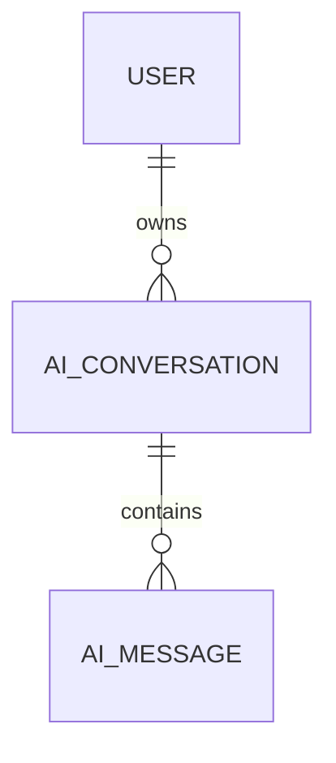
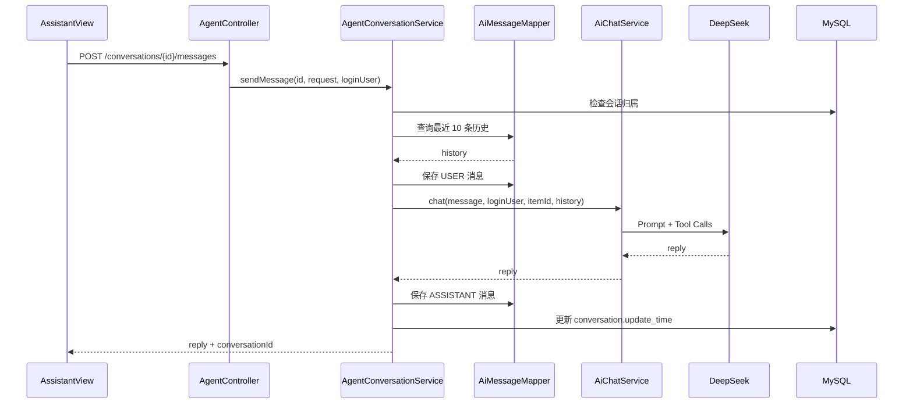

# 多轮会话与用户隔离

## 为什么需要两张表

如果只保存消息，无法清楚划分多段对话。项目使用：

- `ai_conversation`：一段会话的用户、标题、创建和更新时间。
- `ai_message`：属于该会话的每条用户或助手消息。



这样的拆分支持：

- 左侧会话列表。
- 恢复历史消息。
- 删除整段会话。
- 会话标题和最后消息摘要。
- 按用户隔离。

## API

| 操作 | 接口 | 实现 |
| --- | --- | --- |
| 会话分页 | `GET /api/agent/conversations` | `AgentConversationService.list` |
| 新建会话 | `POST /api/agent/conversations` | `create` |
| 查询消息 | `GET /api/agent/conversations/{id}/messages` | `messages` |
| 发送消息 | `POST /api/agent/conversations/{id}/messages` | `sendMessage` |
| 删除会话 | `DELETE /api/agent/conversations/{id}` | `delete` |

所有接口都要求 JWT。

## 发送消息完整流程



真实代码：

- [`AgentConversationService.java`](https://github.com/DoubleliuOne/campus-ai-market/blob/main/src/main/java/com/campusmarket/service/AgentConversationService.java)
- [`AiChatService.java`](https://github.com/DoubleliuOne/campus-ai-market/blob/main/src/main/java/com/campusmarket/ai/service/AiChatService.java)

## 为什么只加载最近 10 条

`loadHistory` 查询：

```sql
SELECT *
FROM ai_message
WHERE conversation_id = ?
ORDER BY create_time DESC, id DESC
LIMIT 10
```

然后反转列表恢复时间顺序。

原因：

| 问题 | 如果加载全部历史 |
| --- | --- |
| Token | 上下文可能超过模型上限 |
| 成本 | 每次请求重复发送大量历史 |
| 延迟 | Prompt 越长，处理越慢 |
| 相关性 | 很久之前的对话可能干扰当前问题 |

10 条只是当前策略，不是通用最优值。更成熟的做法是按 Token 预算、摘要和相关性选择历史。

## 第二层字符限制

除了最近 10 条，`AiChatService` 还有：

- 单条历史最多 4000 字符。
- 历史总量最多 12000 字符。
- 超过单条上限时截断。
- 加入某条会超过总量时跳过该条。

这进一步控制 Prompt 大小。

当前逻辑不会强制保留最近的最后一条；它按时间顺序遍历，若较早消息占满总字符预算，后面的消息会被 `continue` 跳过。这是隐藏的策略细节，也是后续可优化点。

## 用户隔离

每次会话操作先调用：

```java
requireOwnedConversation(conversationId, loginUser)
```

条件：

```text
conversation 存在
&& conversation.userId == loginUser.id
```

不满足统一返回“会话不存在或无权访问”。

为什么不能只靠前端：

- 用户可以修改请求中的 conversationId。
- 前端路由和列表不构成权限。
- 真正的隔离必须在 Service 查询会话时执行。

## 标题生成

- 创建时未传标题 -> `新对话`。
- 第一轮发送成功后，若仍是默认标题 -> 取首条用户消息前 30 个字符。
- 列表中的最后消息摘要 -> 将空白折叠并截取前 60 个字符。

标题只是展示优化，不影响业务状态。

## 失败补偿

流程先保存用户消息，再调用 AI。若 AI 抛异常或返回空白：

```text
删除刚插入的 userMessage
抛出异常
```

这样不会在数据库留下“用户说了话但没有助手回复”的半完成记录。

但需要注意：这段补偿不在完整事务内。`sendMessage` 没有 `@Transactional`，因为外部 AI 调用可能持续数十秒。这样设计减少了长事务，但补偿本身也可能失败，属于当前实现边界。

## 新旧 AI 接口

### `POST /api/agent/chat`

- 兼容旧客户端。
- 不读取也不保存历史。
- `AgentChatResponse.conversationId` 为空。

### `POST /api/agent/conversations/{id}/messages`

- 前端 AI 助手使用。
- 保存历史并加载最近 10 条。
- 返回 conversationId。

前端真实调用位置：[`AssistantView.vue`](https://github.com/DoubleliuOne/campus-ai-market/blob/main/frontend/src/views/AssistantView.vue)

## 会话列表查询

`AiConversationMapper.selectConversationPage` 用子查询取：

- 最后一条消息内容。
- 消息总数。
- 会话创建和更新时间。

它先按 `user_id` 过滤，再按 `update_time DESC, id DESC` 排序，并通过 MyBatis-Plus 分页。

## Markdown 回答

后端返回 Markdown 字符串。前端用：

```javascript
marked.parse(...)
DOMPurify.sanitize(...)
```

这样可以显示标题、列表、粗体和表格，同时清理潜在危险 HTML。

不要直接把模型输出 `v-html` 渲染，除非先做可信的 HTML 清洗。

## 当前限制

- 没有流式输出。
- 没有 Token 精确计数。
- 没有历史摘要压缩。
- 没有会话并发写锁。
- AI 调用期间的长请求可能超时。
- 删除会话的级联和显式删除同时存在，逻辑清楚但不是数据库迁移工具。

## 面试回答

### 为什么有 conversation 和 message 两张表？

> conversation 负责会话级别信息、用户所有权、标题和列表排序；message 负责具体消息和角色。分开后可以快速分页会话、恢复消息，也便于级联删除。

### 为什么只取最近 10 条？

> 多轮上下文不能无限增长。最近消息最可能和当前追问相关，截取 10 条可以控制 Token、成本和延迟。同时 AiChatService 还有单条 4000 字符和总 12000 字符限制。

### 怎么保证用户看不到别人的会话？

> 每个会话操作都先按 conversationId 查询，再检查 `conversation.userId == loginUser.id`。用户 id 来自 JWT，不来自前端参数。

### AI 失败时用户消息会留下吗？

> 当前实现 AI 失败或返回空白时会删除刚插入的用户消息。它不是完整事务，因为不希望把长耗时 AI 调用包在数据库事务里，这是可继续优化的边界。

继续阅读：[RAG、Embedding 与向量检索](./rag.md)。
