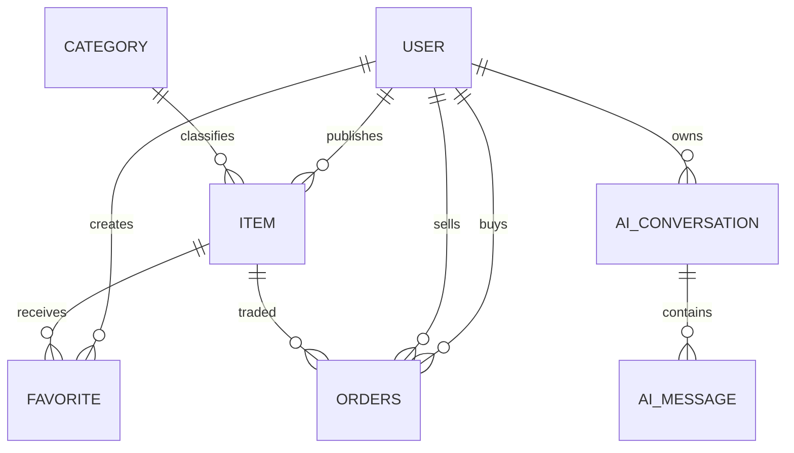
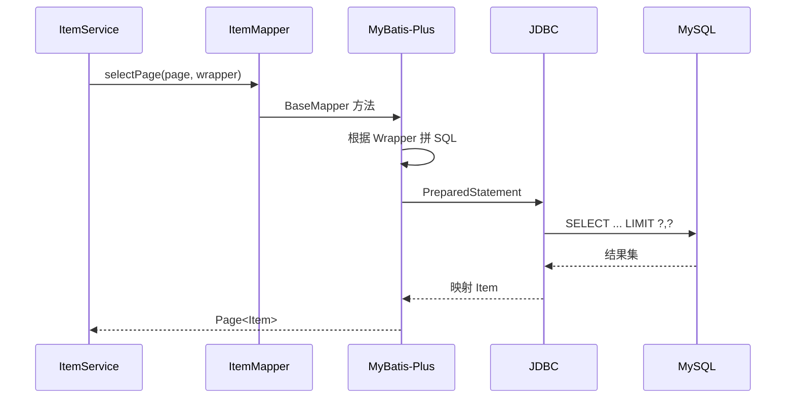

# MySQL 与 MyBatis-Plus

## 数据库总览

建表脚本：

[`sql/init.sql`](https://github.com/DoubleliuOne/campus-ai-market/blob/main/sql/init.sql)

数据库名：`campusai_market`

字符集：`utf8mb4`

七张表：



## `user`

**为什么存在**：统一保存买家和卖家账号。项目没有单独 seller 表，角色由具体业务关系决定。

| 字段 | 类型 | 约束/说明 |
| --- | --- | --- |
| `id` | BIGINT UNSIGNED | 主键、自增 |
| `username` | VARCHAR(50) | 非空、唯一 |
| `password_hash` | VARCHAR(100) | 非空、BCrypt |
| `campus` | VARCHAR(100) | 可空 |
| `create_time` | DATETIME | 默认当前时间 |
| `update_time` | DATETIME | 更新时自动刷新 |

唯一约束：`uk_user_username(username)`

数据来源：

- 注册接口插入。
- `init.sql` 插入 `bob`、`buyer1` 演示账号。

使用方：认证、商品卖家、收藏、订单、AI 会话。

## `category`

**为什么存在**：限制商品分类，避免分类名称在商品表中自由漂移。

| 字段 | 类型 | 约束 |
| --- | --- | --- |
| `id` | BIGINT UNSIGNED | 主键 |
| `name` | VARCHAR(50) | 非空、唯一 |
| `create_time` | DATETIME | 默认当前时间 |

初始化分类：数码产品、教材、宿舍用品、生活用品、其他。

使用方：商品发布、搜索分类筛选、`ItemVO` 展示、前端分类组件。

## `item`

**为什么存在**：保存二手商品事实。

| 字段 | 说明 |
| --- | --- |
| `seller_id` | 发布者，外键到 `user` |
| `category_id` | 分类，外键到 `category` |
| `title` | 标题，最大 100 |
| `description` | 描述 |
| `price` | `DECIMAL(10,2)` |
| `images` | JSON 数组文本 |
| `status` | `ON_SALE/SOLD/OFF_SHELF` |

索引：

- `(seller_id, status)`：卖家按状态查商品。
- `(category_id, status)`：分类筛选在售商品。
- `(status, create_time)`：在售商品按时间排序。

图片没有拆成独立表，因为当前最多 5 张且没有独立查询需求。代价是数据库不便于按图片维度分析。

## `favorite`

**为什么存在**：表达用户与商品的多对多收藏关系。

- `user_id` 外键到 `user`
- `item_id` 外键到 `item`
- 唯一键 `(user_id, item_id)` 防重复收藏
- `idx_favorite_item` 支持按商品查看收藏

并发重复收藏时，`FavoriteService` 同时做了先查询和捕获 `DuplicateKeyException`，数据库唯一约束是最终保障。

## `orders`

**为什么叫 `orders`**：`order` 是 SQL 关键字，使用复数可减少转义，同时表达订单集合。

| 字段 | 说明 |
| --- | --- |
| `buyer_id` | 买家 |
| `seller_id` | 卖家，下单时冗余保存 |
| `item_id` | 商品 |
| `price` | 下单时的价格快照 |
| `status` | 当前订单状态 |

为什么保存 seller 和 price：

- 商品可能修改或下架，订单仍应保留当时交易对象和价格。
- 买家/卖家订单查询可直接按用户字段过滤。

索引：

- `(buyer_id, status)`
- `(seller_id, status)`
- `(item_id)`

当前没有“一个商品只能有一个有效订单”的数据库唯一约束。代码依赖商品 `ON_SALE -> SOLD` 的条件更新保证正常流程不重复下单。

## `ai_conversation`

**为什么存在**：表示一段独立会话，隔离标题、用户和更新时间。

- `user_id` 外键到用户。
- `title` 默认“新对话”。
- `idx_ai_conversation_user_update` 支持按用户和更新时间分页。

每条消息如果直接只存用户和内容，无法有效恢复“哪几句属于同一段对话”。

## `ai_message`

**为什么存在**：保存会话中的单条消息。

- `conversation_id` 外键。
- `role`：`USER` 或 `ASSISTANT`。
- `content`：消息正文。
- `ON DELETE CASCADE`：删除会话时自动删除消息。

`AgentConversationService.delete` 仍显式删除消息再删会话。因为增量脚本和旧库状态可能不完全依赖级联，显式顺序更清晰，也便于未来替换存储。

## MyBatis-Plus 查询链路



## 条件构造器

商品搜索中的关键代码：

```java
queryWrapper
    .eq(Item::getStatus, "ON_SALE")
    .eq(categoryId != null, Item::getCategoryId, categoryId)
    .ge(minPrice != null, Item::getPrice, minPrice)
    .le(maxPrice != null, Item::getPrice, maxPrice)
    .and(normalizedKeyword != null, wrapper -> wrapper
        .like(Item::getTitle, normalizedKeyword)
        .or()
        .like(Item::getDescription, normalizedKeyword));
```

它表达：

```sql
status = 'ON_SALE'
AND category_id = ?            -- 有分类时
AND price >= ?                 -- 有最低价时
AND price <= ?                 -- 有最高价时
AND (title LIKE ? OR description LIKE ?)
```

## 为什么注册分页拦截器

MyBatis-Plus 分页需要：

```java
interceptor.addInnerInterceptor(
    new PaginationInnerInterceptor(DbType.MYSQL)
);
```

没有拦截器时，`selectPage` 不会自动得到正确分页行为。

## 自定义 SQL：行锁

```java
@Select("SELECT * FROM item WHERE id = #{id} FOR UPDATE")
Item selectByIdForUpdate(@Param("id") Long id);
```

它必须在事务中执行。当前调用方 `OrderService.create` 有 `@Transactional`。行锁让两个并发买家查询同一商品时发生串行化，再由条件更新决定谁成功。

## 本项目的查询特点

- 简单 CRUD：BaseMapper。
- 动态筛选：LambdaQueryWrapper。
- 分页：Page + PaginationInnerInterceptor。
- 并发创建订单：自定义 `FOR UPDATE`。
- AI 会话分页：自定义 SQL 返回 VO。
- Entity 到 VO：Service 批量查询关联数据后手工组装。

## 面试回答

### MyBatis-Plus 和 MyBatis 区别？

> MyBatis-Plus 在 MyBatis 上增加 BaseMapper 通用 CRUD、条件构造器和分页插件。项目仍能在 Mapper 上使用 `@Select` 写自定义 SQL，例如订单创建的商品行锁。

### 为什么不用 JPA？

> 这是设计选择而不是优劣判断。项目需要比较直观地控制 SQL、Wrapper 和条件更新，MyBatis-Plus 在 CRUD 便利性和 SQL 可控性之间更符合当前实现。

### 分页是怎么执行的？

> Service 创建 `Page` 和 `LambdaQueryWrapper`，`PaginationInnerInterceptor` 改写查询并生成 count，再执行 MySQL 分页。结果再转换为 `PageResult<VO>` 返回前端。

### 为什么订单存价格快照？

> 商品价格以后可能修改，订单必须记录成交时价格。订单的 `price` 来源是创建订单时读取到的 `item.price`，而不是查询时再关联当前商品价格。

继续阅读：[商品完整业务](./item-business.md)。
