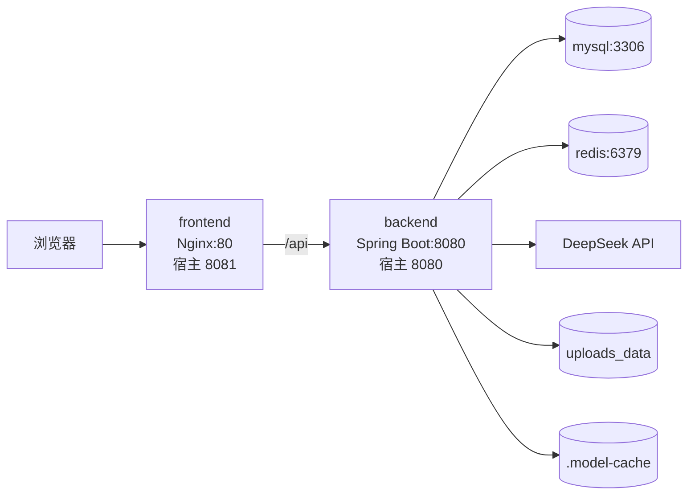

# Docker Compose 部署

## 镜像与容器

- **镜像**：只读模板，包含应用、依赖和启动命令。
- **容器**：镜像的运行实例，有自己的进程和可写层。
- **Volume**：独立持久化数据，不随容器删除而消失。
- **Network**：让 Compose 服务通过服务名访问，例如 `mysql`、`redis`、`backend`。

## 四服务拓扑



真实配置：

- [`docker-compose.yml`](https://github.com/DoubleliuOne/campus-ai-market/blob/main/docker-compose.yml)
- [`backend.Dockerfile`](https://github.com/DoubleliuOne/campus-ai-market/blob/main/backend.Dockerfile)
- [`frontend/Dockerfile`](https://github.com/DoubleliuOne/campus-ai-market/blob/main/frontend/Dockerfile)
- [`frontend/nginx.conf`](https://github.com/DoubleliuOne/campus-ai-market/blob/main/frontend/nginx.conf)

## 后端多阶段构建

### 构建阶段

```dockerfile
FROM maven:3.9.9-eclipse-temurin-17 AS build
WORKDIR /app
COPY pom.xml .
COPY src ./src
RUN --mount=type=cache,target=/root/.m2 \
    mvn -B -Dmaven.test.skip=true clean package
```

作用：

- 在 Maven + Java 17 镜像中编译。
- 跳过测试，缩短部署构建时间。
- Cache mount 复用 Maven 依赖。

### 运行阶段

```dockerfile
FROM eclipse-temurin:17-jre-jammy
RUN apt-get update && apt-get install -y libgomp1 ...
COPY --from=build /app/target/...jar app.jar
ENTRYPOINT ["java", "-jar", "app.jar"]
```

只保留 JRE 和 `libgomp1`。后者供 DJL/ONNX 本地 Embedding 使用。

## 前端多阶段构建

```text
Node 22 Alpine
  -> npm ci
  -> npm run build
  -> 生成 frontend/dist

Nginx Alpine
  -> 复制 dist 到 /usr/share/nginx/html
  -> 复制自定义 nginx.conf
```

运行镜像不包含 Node 和源码，只包含静态资源和 Nginx。

## Nginx 配置

```nginx
location /api/ {
    proxy_pass http://backend:8080;
    proxy_set_header Host $host;
    proxy_set_header X-Real-IP $remote_addr;
    proxy_set_header X-Forwarded-For $proxy_add_x_forwarded_for;
    proxy_read_timeout 300s;
}

location / {
    try_files $uri $uri/ /index.html;
}
```

### `/api` 反向代理

浏览器只能看到 `frontend:80`，后端容器不需要暴露内部 DNS 给浏览器。`backend` 是 Compose 服务名，由 Docker 网络解析。

### SPA fallback

Vue Router 使用 history 模式，直接访问 `/orders` 时 Nginx 上并不存在这个文件。`try_files ... /index.html` 让 Vue 接管路由。

### 超时

AI 调用可能较慢，因此 Nginx 的读写超时提高到 300 秒。前端 Axios 仍是 60 秒，实际端到端超时不会超过前端限制。

## Environment

Compose 不把真实密钥写入镜像，通过 environment 注入：

```yaml
SPRING_PROFILES_ACTIVE: docker
MYSQL_PASSWORD: ${MYSQL_PASSWORD}
DEEPSEEK_API_KEY: ${DEEPSEEK_API_KEY}
JWT_SECRET: ${JWT_SECRET}
```

Spring 通过 `${...}` 读取。`.env.example` 是模板，真实 `.env` 被 Git 忽略。

## Volume

```yaml
volumes:
  mysql_data:
  uploads_data:
```

挂载：

```text
mysql_data    -> /var/lib/mysql
uploads_data  -> /app/uploads
./.model-cache -> /models
```

MySQL 和图片是持久数据；模型缓存可以重建，但本地挂载能减少重复下载。

## `depends_on` 与健康检查

Compose 使用条件：

```yaml
depends_on:
  mysql:
    condition: service_healthy
  redis:
    condition: service_healthy
```

后端等 MySQL 和 Redis healthy；前端等 backend 健康检查通过。

`depends_on` 不等于应用完全就绪。Spring Boot 自己通过连接池和启动流程处理依赖，健康检查只是 Compose 层面启动顺序。

## MySQL 初始化

```yaml
volumes:
  - ./sql:/docker-entrypoint-initdb.d:ro
```

MySQL 首次创建数据目录时执行 `/docker-entrypoint-initdb.d` 内的 SQL。已有 `mysql_data` 时不会重复执行 `init.sql`，所以升级需要手动运行迁移。

增量脚本：

[`V2__phase14_ai_and_order_status.sql`](https://github.com/DoubleliuOne/campus-ai-market/blob/main/sql/migrations/V2__phase14_ai_and_order_status.sql)

## 启动

```powershell
Copy-Item -LiteralPath '.env.example' -Destination '.env'
docker compose -f 'D:\CampusAI Market\docker-compose.yml' up -d --build
docker compose ps
```

访问：

- 前端：`http://localhost:8081/`
- 后端：`http://localhost:8080/`
- Swagger：`http://localhost:8080/swagger-ui/index.html`

## 常见部署问题

### 1. MySQL 首次初始化失败

查看：

```powershell
docker compose logs mysql
```

如果数据卷已存在，`init.sql` 不会再自动执行。

### 2. 中文乱码

SQL 开头有 `SET NAMES utf8mb4`，MySQL command 也设置 `utf8mb4/utf8mb4_unicode_ci`。

### 3. Embedding 下载为空

模型站可能网络不稳。将已验证的 `model.onnx`、`tokenizer.json` 放入 `.model-cache`，在 `.env` 中指向 `/models`。

### 4. AI 503

优先检查 `DEEPSEEK_API_KEY`、网络和 DeepSeek 服务。后端 AI 未配置时会返回 503。

### 5. 前端 404

检查 Nginx 的 SPA fallback；直接访问 Vue 路由需要回退到 `index.html`。

## 生产级差距

当前 Compose 适合演示和单机部署，但缺少：

- Kubernetes 或多个后端实例
- Secrets 管理系统
- 反向代理 TLS
- 集中日志和指标
- 备份与恢复策略
- 对象存储
- Redis/MySQL 高可用
- 自动迁移工具

## 面试回答

### Dockerfile 和镜像、容器有什么关系？

> Dockerfile 定义如何构建镜像，镜像运行起来才成为容器。项目后端用 Maven 构建阶段生成 JAR，再用 JRE 运行阶段启动；前端用 Node 构建，再复制到 Nginx。

### Compose 怎么让前端访问后端？

> Nginx 的 `/api` location 代理到 `http://backend:8080`。`backend` 是 Compose 服务名，Docker 内置 DNS 把服务名解析到对应容器。

### 数据怎么持久化？

> MySQL 使用 `mysql_data`，上传图片使用 `uploads_data`，本地 Embedding 目录挂载到 `/models`。删除容器不会删除命名 Volume。

### 为什么用 Volume 而不是 COPY 图片目录？

> 图片是运行时数据，不是镜像内容。Volume 能跨容器重建保存数据，也让镜像保持无状态、可复现。

继续阅读：[六大完整业务链路](./request-chains.md)。
