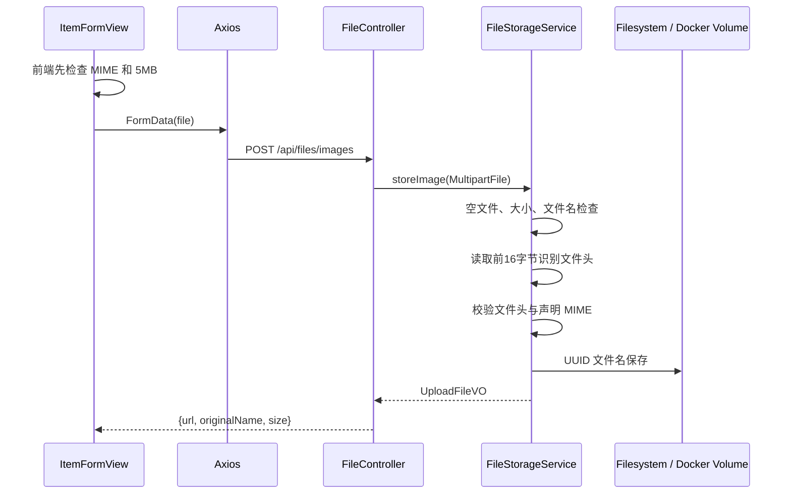

# 图片上传与持久化

## 上传链路



真实代码：

- [`FileController.java`](https://github.com/DoubleliuOne/campus-ai-market/blob/main/src/main/java/com/campusmarket/controller/FileController.java)
- [`FileStorageService.java`](https://github.com/DoubleliuOne/campus-ai-market/blob/main/src/main/java/com/campusmarket/service/FileStorageService.java)
- [`StorageProperties.java`](https://github.com/DoubleliuOne/campus-ai-market/blob/main/src/main/java/com/campusmarket/config/StorageProperties.java)

## 支持格式与限制

支持：

- JPEG
- PNG
- WebP
- GIF

限制：

- 单张最大 5 MB。
- 每个商品最多 5 张。
- Spring Multipart 单文件 5 MB。
- Spring Multipart 请求最大 25 MB。

前端先检查提高体验，后端检查保证安全。

## 为什么不能相信后缀

客户端可以把恶意内容命名为 `photo.png`。只按扩展名判断会错误接受文件。项目同时检查：

1. 浏览器声明的 `Content-Type` 必须属于白名单。
2. 文件前缀必须匹配 JPEG、PNG、WebP 或 GIF 的 magic bytes。
3. 两者必须一致。

例如：

```text
声明 image/png
文件头是 JPEG
-> 图片内容与文件类型不一致
```

## 文件名与路径安全

保存名：

```text
UUID(无短横线).扩展名
```

原始文件名只放在响应 VO 中，不参与磁盘路径。

`resolveInsideRoot` 会规范化路径并检查：

```java
resolved.startsWith(imageRoot)
```

它防止 `..` 或绝对路径逃逸上传根目录。`loadImage` 还要求文件名不含 `..` 和 `/`，Controller 用正则限制为 32 位十六进制加扩展名。

## 公开访问

上传结果 URL：

```text
/api/files/images/<32位文件名>
```

读取接口公开，并返回 30 天公共缓存：

```text
Cache-Control: public, max-age=2592000
```

文件内容类型由已校验扩展名映射，不猜服务器文件系统 MIME。

## 本地目录与 Docker Volume

本地默认：

```properties
app.storage.upload-dir=${UPLOAD_DIR:./uploads}
```

Docker：

```yaml
backend:
  volumes:
    - uploads_data:/app/uploads
  environment:
    UPLOAD_DIR: /app/uploads
```

Volume 的作用：

- 容器重建后文件仍存在。
- 数据库只保存 `/api/files/images/...` 路径。
- 后端容器和应用文件系统解耦。

## 外部 URL 与本地文件

商品 `images` 是字符串列表，因此可以保存：

```text
/api/files/images/<uuid>.jpg
https://example.com/photo.jpg
```

当前上传接口只接收本地文件。外部 URL 由发布页的“添加链接”直接写入商品 DTO。

这说明：

- 本地文件是受控上传流程。
- 外部 URL 仍依赖第三方可用性和安全策略。
- 后端当前没有下载或代理外部 URL。

## 安全问题

当前已做：

- 文件头和 MIME 双重检查。
- 服务端生成文件名。
- 路径规范化。
- 大小限制。
- 后缀白名单读取规则。

仍可继续增强：

- 图片解码验证，防止“带合法文件头但内容是畸形图片”。
- 病毒扫描。
- 图片压缩和缩略图。
- 对象存储和签名 URL。
- 按用户配额和频率限制。
- 清理未关联商品的孤儿图片。

## 面试回答

### 图片上传怎么保证安全？

> 前端只做体验层校验，后端会检查大小、声明 MIME 和文件头，两者必须匹配。文件名由服务端 UUID 生成，并用规范化路径检查防止路径穿越。读取接口再用严格正则限制文件名。

### 为什么用 Docker Volume？

> 容器本身的文件系统随容器删除而丢失。`uploads_data` 挂载到 `/app/uploads` 后，即使重建后端容器，商品图片仍保留。

### 为什么不做 Base64 存数据库？

> 图片放在数据库会增加行大小、备份和查询负担。当前项目把文件放本地卷、数据库只存 URL，职责更清楚。多实例部署时需要替换为对象存储。

继续阅读：[Agent 与 Tool Calling](./agent-tool-calling.md)。
