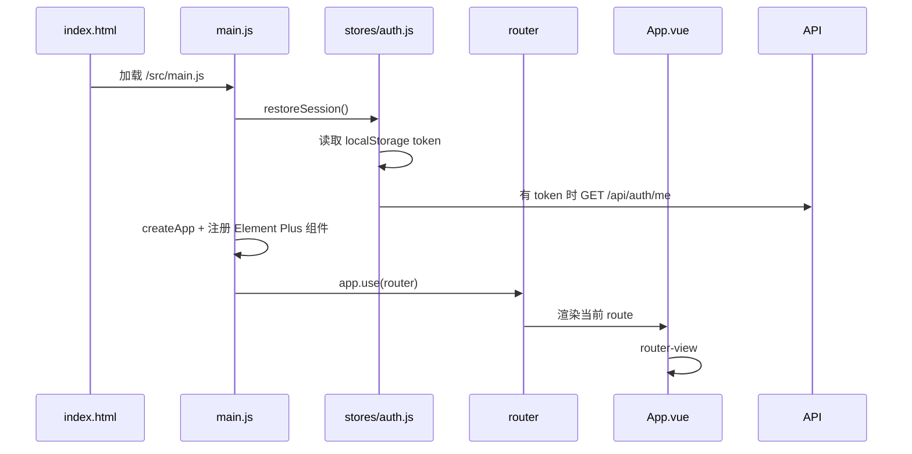
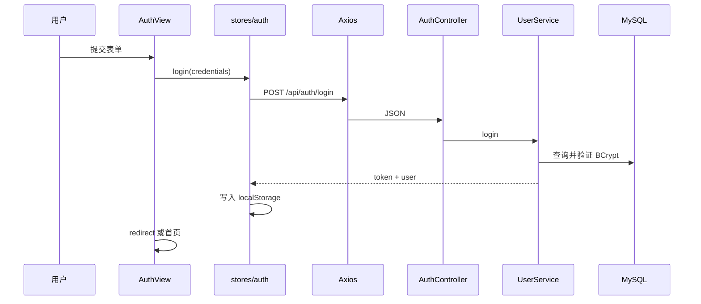

# Vue 前端源码学习

## 前端技术职责

| 技术 | 文件 | 项目职责 |
| --- | --- | --- |
| Vue 3 | `main.js`、各 `.vue` | 组件、响应式状态和页面渲染 |
| Vite | `vite.config.js` | 开发代理、构建和手动分包 |
| Vue Router | `router/index.js` | 路由、懒加载和登录守卫 |
| Axios | `api/http.js` | Token、响应解包和 401 处理 |
| Element Plus | `main.js`、页面组件 | 表单、按钮、分页、标签页 |
| lucide | 页面组件 | 功能图标 |
| marked + DOMPurify | `AssistantView.vue` | Markdown 渲染与清洗 |

## 启动过程



真实入口：[`frontend/src/main.js`](https://github.com/DoubleliuOne/campus-ai-market/blob/main/frontend/src/main.js)

## Axios 封装

[`http.js`](https://github.com/DoubleliuOne/campus-ai-market/blob/main/frontend/src/api/http.js) 做三件关键事。

### 1. 统一 Base URL

```javascript
const http = axios.create({
  baseURL: '/api',
  timeout: 60000,
})
```

页面调用 `/items`，实际发出 `/api/items`。

### 2. 自动附加 JWT

```javascript
config.headers.Authorization = `Bearer ${token}`
```

页面不用每次手动添加 Header。

### 3. 统一响应和 401

后端响应：

```json
{
  "code": 200,
  "message": "success",
  "data": {}
}
```

响应拦截器检查 `code`：

- 成功只返回 `body.data`。
- 业务错误创建 Error 并 reject。
- HTTP 401 清理本地会话并跳转 `/login`。

这解释了为什么页面里 `await listItemsApi()` 得到的已经是分页对象，而不是完整 `ApiResponse`。

## API 模块

[`api/index.js`](https://github.com/DoubleliuOne/campus-ai-market/blob/main/frontend/src/api/index.js) 把所有后端路径集中在函数中：

```javascript
export const listItemsApi = (params) => http.get('/items', { params })
export const createOrderApi = (itemId) => http.post('/orders', { itemId })
export const sendConversationMessageApi = (id, data) =>
  http.post(`/agent/conversations/${id}/messages`, data)
```

好处：

- URL 只维护一处。
- 页面代码按业务函数调用。
- 参数结构更直观。

## 路由与登录守卫

[`router/index.js`](https://github.com/DoubleliuOne/campus-ai-market/blob/main/frontend/src/router/index.js)：

- `AuthView`、首页、详情、发布、收藏、订单、AI 都使用动态 import。
- `requiresAuth` 表示登录后才能访问。
- `guestOnly` 表示已登录用户不能重复进入登录页。
- `router.beforeEach` 先恢复会话，再判断跳转。

动态 import 让页面按需加载，Vite 构建时形成多个异步 chunk。

## 登录状态

[`stores/auth.js`](https://github.com/DoubleliuOne/campus-ai-market/blob/main/frontend/src/stores/auth.js) 没有引入 Pinia，而是使用 Vue `reactive`：

```javascript
export const authState = reactive({
  token: stored.token,
  user: stored.user,
  restoring: true,
})
```

功能：

- Token 和用户信息持久化到 `localStorage`。
- 启动时调用 `/api/auth/me` 恢复。
- 401 时清理。
- 登出时即使后端失败也清理本地状态。

这不是全局状态库，但足够处理当前登录会话。

## 登录按钮的完整链路



前端只负责提交和保存，密码校验与 JWT 签发完全在后端。

## 首页商品搜索

[`HomeView.vue`](https://github.com/DoubleliuOne/campus-ai-market/blob/main/frontend/src/views/HomeView.vue)：

1. `onMounted` 加载分类和商品。
2. 筛选条件保存在 `filters`。
3. 点击搜索时把 `filters` 复制到 `applied`。
4. 调用 `listItemsApi`。
5. 使用 `requestId` 丢弃过期响应，避免快速搜索时旧请求覆盖新结果。
6. 分类按钮、价格和排序改变后重新加载。
7. 点击“让 AI 帮我找”跳转 `/assistant?prompt=...`。

## 商品详情与购买

[`ItemDetailView.vue`](https://github.com/DoubleliuOne/campus-ai-market/blob/main/frontend/src/views/ItemDetailView.vue)：

- `manage=1` 时调用卖家详情接口。
- 非卖家调用公开详情并检查收藏状态。
- `isSeller` 由当前用户 id 和 `item.sellerId` 计算。
- `buyNow` 先确认，再调用 `createOrderApi`。
- 成功后跳转订单页。

前端隐藏购买按钮不代表安全；后端 `OrderService.create` 还会检查本人商品、商品状态和并发。

## 发布与图片上传

[`ItemFormView.vue`](https://github.com/DoubleliuOne/campus-ai-market/blob/main/frontend/src/views/ItemFormView.vue)：

- 发布和编辑共用页面，由路由 `id` 判断。
- 图片文件先在前端检查格式和大小。
- 每个文件通过 `FormData` 发送到上传接口。
- 支持并发上传 `Promise.allSettled`。
- 也允许填写 HTTP URL 或 `/api/files/images/...`。
- 提交时把作品 URL 列表放入 `images`。

## AI 助手

[`AssistantView.vue`](https://github.com/DoubleliuOne/campus-ai-market/blob/main/frontend/src/views/AssistantView.vue) 是三栏布局：

- 左：会话列表和新建/删除。
- 中：消息、输入和发送。
- 右：Agent 能力说明。

### 发送消息

```text
sendMessage
  -> 没有 activeConversationId 时先 createConversationApi
  -> 乐观插入 user 消息
  -> sendConversationMessageApi
  -> 成功后根据响应更新会话标题、摘要和消息数
  -> 追加 assistant 消息
```

失败后会把乐观插入的用户消息移除。

### 当前商品上下文

商品详情页的“问问 AI”跳转：

```text
/assistant?itemId=5
```

AI 页面读取 `route.query.itemId`，每次发送都带 `itemId` 给后端。后端注入真实商品详情并交给模型。

### Markdown 安全

```javascript
const html = marked.parse(content)
return DOMPurify.sanitize(html)
```

不加 DOMPurify 直接把模型文本当 HTML 渲染会产生 XSS 风险。

## Vite 开发代理

```javascript
server: {
  host: '127.0.0.1',
  port: 5173,
  proxy: {
    '/api': {
      target: 'http://localhost:8080',
      changeOrigin: true,
    },
  },
}
```

生产环境没有 Vite Server，由 Nginx 做 `/api` 代理。

## 手动分包

`vite.config.js` 把依赖分组：

- `vendor-vue`
- `vendor-element`
- `vendor-icons`
- `vendor-markdown`
- `vendor-http`
- `vendor-misc`

它减少单个大 chunk，并利用浏览器缓存。

## 面试回答

### 前端怎么带 JWT？

> Axios 请求拦截器每次从 localStorage 读取 Token，并写入 `Authorization: Bearer`。如果后端返回 401，响应拦截器清理会话并跳转登录页。

### 路由守卫能保证安全吗？

> 不能，它只控制页面访问体验。真正的数据权限在后端 Security 和 Service 查询条件中，例如订单只按当前 JWT 用户过滤。

### 为什么用 DOMPurify？

> AI 回答是 Markdown，前端用 marked 转 HTML。模型输出不可完全信任，DOMPurify 清理危险标签和属性，避免 `v-html` 产生脚本注入。

### Vite 和 Nginx 分别做什么？

> Vite Dev Server 只服务开发环境，负责热更新和 `/api` 代理；Nginx 服务生产构建结果，提供静态文件、SPA fallback 和到后端的 `/api` 反向代理。

继续阅读：[Docker Compose 部署](./docker-deploy.md)。
