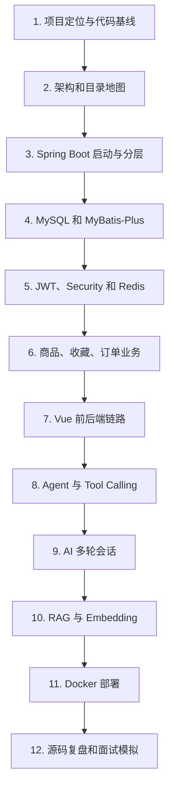

# 学习指南

这门课程的目标不是让你“看过项目”，而是让你能够：

- 不看笔记，画出系统架构和主要数据关系。
- 从一个 Vue 按钮讲到 Java Controller、Service、Mapper、MySQL 或 Redis。
- 解释 AI 为什么能调用 Java Tool，以及 Spring AI 在中间做了什么。
- 解释 RAG 的每个阶段、当前实现的限制和优化方向。
- 面对面试官质疑时，不夸大数据量，不把毕业设计讲成生产级系统。
- 在现有代码上新增接口、表字段、缓存策略或 AI Tool。

## 唯一事实来源

本课程以 GitHub 仓库 `DoubleliuOne/campus-ai-market` 的 `main` 分支为唯一依据。本次生成时：

```text
本地 HEAD  = b3c73f186b8a81e1fb763eed45a501b06df604ac
origin/main = b3c73f186b8a81e1fb763eed45a501b06df604ac
```

仓库中的 `README.md` 和 `CONTEXT.md` 用于辅助定位，但遇到差异时以 Java、Vue、SQL、Docker 配置等实际代码为准。

## 每个重要知识点怎么学

每个主题都尽量回答五个问题：

1. **是什么**：概念本身。
2. **为什么使用**：它解决哪一类问题。
3. **项目哪里使用**：真实文件、类和方法。
4. **具体怎么实现**：调用顺序、参数、返回值、SQL、缓存 Key 或容器配置。
5. **面试怎么回答**：一句话回答、项目展开、追问和边界。

## 推荐顺序



## 学习状态判断

学完一章后，不要只问“我读完了吗”，而要能用下面的方式自测：

| 等级 | 表现 |
| --- | --- |
| 看得懂 | 能说出类和方法的职责 |
| 讲得清 | 不看代码能画出调用链并解释参数 |
| 改得动 | 能定位改动点，知道会影响哪些模块 |
| 答得稳 | 能主动说明方案边界、风险和替代方案 |

## 建议产出

每学完一个模块，自己写一页纸：

```text
业务目标：
入口接口：
核心类：
数据库：
缓存：
异常与权限：
完整调用链：
我能改进：
面试官可能追问：
```

## 当前项目最重要的三类问题

### 1. 交易一致性

重点看 `OrderService`、`OrderStatusPolicy`、`ItemMapper.selectByIdForUpdate`、商品与订单状态字段。要能解释事务、行锁、条件更新分别解决什么问题。

### 2. AI 是否真正接入业务

重点看 `AiChatService`、`ItemTools`、`OrderTools`、`ToolCallBudget`。要能区分“把数据库结果拼进 Prompt”和“LLM 通过 Tool Calling 主动选择 Java 方法”。

### 3. RAG 是否必要、是否可靠

重点看 `KnowledgeBaseService`、`RagProperties`、`trading-rules.txt`。要能说明为什么规则问题走 RAG，商品和订单问题走 Tool。

下一步从 [项目总览与代码基线](./project-overview.md) 开始。
