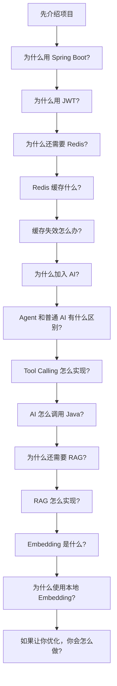

# 高频追问树与面试官质疑

## 追问树

## 1. 为什么选择 Spring Boot？

**可接受回答**：

> 项目需要 Web、Security、Validation、Redis、MyBatis 和 AI 多个组件。Spring Boot 的 Starter 和自动配置减少装配成本，内嵌 Tomcat 简化启动，同时仍保留 Spring 的 IOC、DI、AOP、事务和安全体系。

**不要这样回答**：

> 因为 Spring Boot 简单。

原因是没有解释项目需要什么、Spring Boot 具体解决了什么。

## 2. 为什么使用 JWT，不用 Session？

> 前后端分离 API 更需要无状态身份传递。JWT 放在 Authorization Header，服务端验签即可得到用户身份，不需要保存会话。项目用 Redis 黑名单补上主动登出。

**追问**：JWT 能主动失效吗？

> 单靠 JWT 不能。项目在登出时把 Token SHA-256 写入 Redis，Key 的 TTL 等于 Token 剩余时间，所以能拒绝已登出的 Token。Redis 故障时黑名单会暂时失效，这是可用性和安全之间的降级。

## 3. 为什么用 Redis？是不是为了用而用？

> 当前 Redis 有三项明确用途：登出 Token 黑名单、热门商品缓存和版本化搜索缓存。它们分别是短时状态和可重建读数据，适合 Redis。用户、商品和订单的最终事实仍在 MySQL。

**追问**：不用 Redis 可以吗？

> 可以，项目仍能启动，但登出无法主动失效，热门和重复搜索会直接打 MySQL。Redis 是性能和安全能力，不是核心数据存储。

## 4. 缓存怎么失效？

> 热门缓存直接删除。搜索缓存递增版本号，新请求使用新版本 Key，旧 Key 等 TTL 过期。订单事务在 `afterCommit` 后执行失效，避免回滚时清缓存。

**追问**：Redis 删除失败怎么办？

> 当前捕获异常并依赖 TTL。超时期间可能读到旧数据。生产环境应加监控和补偿任务，对强一致场景应重新评估缓存策略。

## 5. 为什么加入 AI？

> 传统搜索只适应用户已经想到的关键词。AI 能把“200 元以内宿舍用的小电器”等自然语言转成查询条件，并在真实数据上回答。项目重点是让 AI 接入业务，而不是做孤立聊天框。

**追问**：AI 会不会增加系统故障点？

> 会。因此 AI 不可用时返回 503，普通商品、订单接口不受影响；AI Tool 复用业务层；RAG 初始化失败只跳过规则增强，不阻止后端启动。

## 6. Agent 和普通 AI 调用区别？

> 普通调用把 Prompt 发给模型就结束。Agent 额外提供 Tool Schema，模型可以选择调用 Java 工具，取得真实结果后继续生成。

**追问**：这个 Agent 有多自主？

> 它是工具型 Agent 的最小实现，能自主决定是否调用预注册 Tool，但没有复杂任务规划、自主创建工具或多 Agent 协作。

## 7. Tool Calling 怎么实现？

> `ItemTools` 和 `OrderTools` 是 Spring Bean，通过 `ChatClient.Builder.defaultTools` 注册。`@Tool` 和 `@ToolParam` 生成 Schema。模型输出工具名和参数，Spring AI 执行 Java 方法，把结果返回模型。

**追问**：如果模型把商品名填进 categoryId 呢？

> 参数类型转换会失败或触发错误，Tool 的异常处理会返回可读失败文本。当前没有自动重试；更强实现可以校验 Schema、记录轨迹并根据错误提示模型重试一次。

## 8. AI 怎么调用 Java？

> 这是面试最重要的一题，要明确：**LLM 不执行 Java**。它只生成结构化 Tool Call。Spring AI 负责匹配工具、转换参数、注入 ToolContext 和调用 Java 方法。Java 方法再调用 Service、Mapper 和 MySQL。

**追问**：那 AI 是不是直接访问数据库？

> 不是。Tool 调用的是 Service，数据库权限和业务规则都在 Java 侧。模型不能写 SQL，也不能指定任意用户 id。

## 9. 为什么还需要 RAG？

> Tool 解决实时业务查询，但平台规则在源码知识文档里，不在商品或订单表中。RAG 用 Embedding 检索规则段落，减少模型编造平台政策。

**追问**：规则只有几段，为什么不直接放 Prompt？

> 可以直接放，而且当前规模也许更简单。项目选择 RAG 是为了演示检索流程和降低后续知识量增长时的 Prompt 成本。面试时应承认当前规模小，不做过度包装。

## 10. RAG 怎么实现？

> `trading-rules.txt` 按 `##` 切成 5 个文档，本地 Transformers Embedding 生成向量，放入 SimpleVectorStore。规则关键词触发检索，topK 为 3，把文本注入当前用户消息，DeepSeek 根据上下文回答。

**追问**：有相似度阈值吗？

> 没有，代码使用 `similarityThresholdAll()`。这可能返回弱相关文档，当前用规则关键词门控补偿。优化重点是增加阈值和中文评测。

## 11. Embedding 是什么？

> 把文本映射成高维数值向量，使语义相近的文本在向量空间距离接近。用户问题和规则文档都编码后，可以用余弦相似度排序。

**追问**：Embedding 和普通搜索区别？

> 普通 LIKE 匹配字符，Embedding 更强调语义。但 Embedding 不精确、需要模型和评测，价格、用户 id、订单状态这类精确条件仍应由数据库查询。

## 12. 为什么使用本地 Embedding？

> 规则文档不需要发给第三方，且可以复用现有 ONNX 模型，避免额外 Embedding API 成本。代价是模型文件和内存由应用维护，首次加载较慢，当前中文效果一般。

**追问**：以后怎么换中文模型？

> 替换 `EMBEDDING_MODEL_URI` 和 tokenizer，重新构建向量，并先建立中文检索评测集。不能只看演示问题是否“感觉更好”。

## 13. 如果让你优化，优先做什么？

> 先提高正确性和可验证性，再做扩展。订单增加集成测试和数据库约束；RAG 增加中文评测与最低相似度；Tool Call 增加脱敏轨迹和重试；图片改对象存储；生产环境加 TLS、Secrets、备份和监控。

**追问**：为什么不上微服务？

> 当前流量和模块规模不足以证明微服务收益。单体还有清晰事务边界，拆分会增加分布式事务、网络和运维成本。应由规模和组织边界驱动。

## 面试官视角：最容易质疑的项目点

### Redis 有没有必要？

**结论**：黑名单和重复搜索有明确价值，热门缓存价值取决于真实流量。

**回答方向**：不要夸大 QPS。说明 Redis 是可降级层，项目为学习缓存策略和主动登出而使用。

### Agent 算不算真正的 Agent？

**结论**：算工具型 Agent 的最小实现。

**回答方向**：模型可自主选择工具并基于结果继续，缺少自主规划、反思、多工具链和长期任务。

### RAG 数据量这么小有必要吗？

**结论**：从纯效果看不一定必要，从学习完整 RAG 流程看合理。

**回答方向**：承认 5 段知识可以直接拼 Prompt，同时说明替换向量库和文档加载后可扩展。

### SimpleVectorStore 局限是什么？

**结论**：内存、无持久化、无分布式、无复杂过滤。

**回答方向**：重启重建、多实例不共享、规模扩大不适合。当前知识量小，成本低。

### 本地 Embedding 有什么缺点？

**结论**：模型加载、内存、中文效果和运维成本由应用承担。

**回答方向**：优点是隐私和离线；缺点是首次加载与中文效果。生产要评测和模型版本管理。

### 并发下订单安全吗？

**结论**：正常状态转换下有行锁和条件更新；数据库级一商品一订单约束、支付超时和集成并发测试仍不足。

**回答方向**：区分“已实现”和“生产级仍需补的边界”。

### JWT 安全吗？

**结论**：签名机制本身可用，但 Token 存储、XSS、HTTPS、黑名单故障和高权限撤销都需要认真处理。

**回答方向**：不说“绝对安全”；解释 Payload 可解码、Redis 降级、localStorage 风险。

### 图片上传安全吗？

**结论**：有文件头、MIME、路径、UUID 和大小保护；未做深度解码、病毒扫描和对象存储。

**回答方向**：不要只看扩展名，也不能声称 magic bytes 检查能识别所有恶意文件。

### Docker 部署有什么问题？

**结论**：适合单机演示，不是生产高可用。

**回答方向**：缺 TLS、Secrets、备份、监控、多实例、自动迁移和高可用。

### 项目还有什么不足？

1. 订单缺少支付和争议流程。
2. RAG 缺少检索评测和阈值。
3. AI 没有流式输出和 Tool 调用可视化。
4. Redis 关键失效策略没有集成测试。
5. 图片依赖本地卷。
6. 缺少真正的 CI 后端测试和质量门禁。
7. `CONTEXT.md` 与 `NEXT_STEPS.md` 的部分状态过时。

## 压力面试回答原则

- 先回答结论，再解释。
- 能给出真实类和方法。
- 不说“因为这个技术火”。
- 不把学习项目包装成大规模系统。
- 主动说出限制和替代方案。
- 不知道时说明需要进一步确认，不编造。

继续阅读：[十二阶段学习路线](./learning-roadmap.md)。
