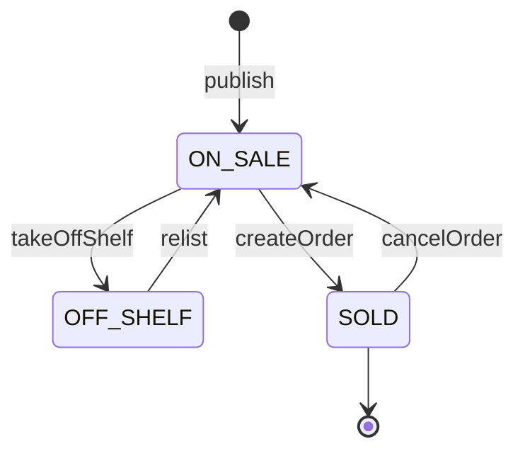
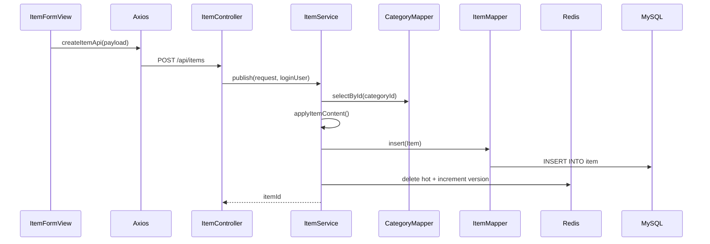

# 商品完整业务

## 商品状态



当前代码没有把 `SOLD -> OFF_SHELF` 设计成合法操作。已售商品不能下架，也不能重新上架。

## 发布商品

入口：[`POST /api/items`](https://github.com/DoubleliuOne/campus-ai-market/blob/main/src/main/java/com/campusmarket/controller/ItemController.java)



核心规则：

- DTO 做基础校验。
- Service 再次校验标题、分类、价格和图片数量。
- sellerId 来自 JWT，不能由前端指定。
- status 固定为 `ON_SALE`。
- 写操作调用 `evictItemCaches()`。

## 搜索与分页

入口：`GET /api/items`

参数：

| 参数 | 含义 |
| --- | --- |
| `keyword` | 标题或描述模糊搜索 |
| `categoryId` | 分类 |
| `minPrice` / `maxPrice` | 价格区间 |
| `sort` | `latest`、`priceAsc`、`priceDesc` |
| `page` / `size` | 分页，size 最大 100 |

搜索先构造 Redis Key：

```text
cache:item:search:v1:<version>:<sha256(canonical-condition)>
```

缓存未命中时查询 MySQL：

```text
status = ON_SALE
AND 可选分类
AND 可选价格范围
AND (title LIKE 或 description LIKE)
ORDER BY 选择排序
LIMIT 分页
```

然后把 `PageResult<ItemVO>` JSON 写入 Redis 90 秒。

### 为什么 Key 用哈希

条件字符串可能很长并包含空格、中文和符号。规范化为固定顺序后用 SHA-256 生成短且稳定的键，避免 Redis Key 无限制增长。

### 为什么有版本号

商品写操作不遍历删除所有搜索缓存，而是递增版本：

```text
搜索请求 A -> version=10 -> key 10:hashA
商品写操作 -> version=11
下一次搜索 -> key 11:hashA
```

旧键自然过期，不会返回旧数据。这是“空间换一致性”的实现。

## 热门商品

入口：`GET /api/items/hot`

规则：

- 只查 `ON_SALE`
- 按 `create_time DESC`
- 限制 10 条
- Redis Key：`cache:item:hot`
- TTL：300 秒
- 商品写操作主动删除

当前“热门”实际上是“最近发布的前 10 件在售商品”，不是按浏览量、收藏数或订单数计算。

## 商品详情

### 公开详情

`GET /api/items/{id}`：

- 商品不存在返回业务错误。
- 非卖家只能看到 `ON_SALE`。
- 已售和已下架商品对普通用户表现为不存在。

### 卖家管理详情

`GET /api/items/{id}/manage`：

- 需要 JWT。
- 必须是商品卖家。
- 可查看 `ON_SALE`、`SOLD`、`OFF_SHELF`。

前端 `ItemDetailView` 根据 `query.manage=1` 选择对应 API。

## 修改商品

入口：`PUT /api/items/{id}`

规则：

1. 商品必须存在。
2. 当前用户必须是卖家。
3. 商品必须是 `ON_SALE`。
4. 条件更新同时匹配 id、sellerId 和当前状态。
5. 更新 0 行说明并发状态下发生变化。

为什么不是先查后直接 update：

- 先查负责给出明确业务错误。
- 条件 update 负责防止查询与更新之间状态变化。

## 下架与重新上架

### 下架

`DELETE /api/items/{id}`

- 已售出商品不能下架。
- 已下架商品重复调用直接返回。
- `ON_SALE -> OFF_SHELF` 使用条件更新。

### 重新上架

`PATCH /api/items/{id}/relist`

- 只有 `OFF_SHELF` 可以重新上架。
- `SOLD` 不能重新上架。
- 条件更新防止重复或并发操作。

两者成功后都会清理热门缓存并递增搜索缓存版本。

## 我的商品

入口：`GET /api/items/mine`

查询条件：

```text
seller_id = 当前用户
可选 status
ORDER BY create_time DESC
```

前端 `MyItemsView` 提供全部、在售、已售出、已下架四个状态标签页，并根据状态显示下架或重新上架操作。

## 商品 Entity 到 VO

`ItemService.toItemVOs` 的步骤：

1. 收集去重后的 sellerId。
2. 收集去重后的 categoryId。
3. 批量查询用户和分类。
4. 建立 Map。
5. 逐个组装 `ItemVO`。
6. 将 images JSON 解析为 List。

这种方式避免每条商品都单独查一次卖家和分类。

## 图片字段

数据库 `item.images` 是 JSON 数组文本，例如：

```json
["/api/files/images/7f0c1cba4d0f4f169834cb50a1f56a0d.jpg"]
```

Service 会：

- 过滤空白。
- 去重。
- 每条最多 500 字符。
- 最多保留 5 条。
- 无法解析时返回空列表，而不是让整个查询失败。

## 权限检查位置

| 操作 | 主要权限点 |
| --- | --- |
| 发布 | JWT 提供 sellerId |
| 修改 | `getOwnedItem` + update 条件 |
| 下架 | 卖家 + 状态 |
| 重新上架 | 卖家 + `OFF_SHELF` |
| 管理详情 | `getOwnedItem` |
| 公开详情 | 非卖家只能看 ON_SALE |

## 面试回答

### 商品搜索为什么要缓存？

> 首页和 AI 搜索会频繁使用相同条件。项目用 90 秒版本化搜索缓存降低 MySQL 压力。商品写操作递增版本号，下一次查询自然使用新 Key，旧 Key 靠 TTL 过期。

### 缓存和数据库不一致怎么办？

> 项目写 MySQL 成功后清热门缓存或递增搜索版本。搜索缓存不做双写。旧版本键最多保留 90 秒但不会被新请求读取。Redis 故障时直接查 MySQL，所以核心数据仍正确。

### 热门商品怎么定义？

> 当前代码定义为最近发布的 10 件在售商品，存在 Redis 300 秒。它没有统计浏览量或订单量，面试时应明确这一点。

### 为什么修改商品使用条件更新？

> 先查再更新之间商品可能被别人下单或下架。`WHERE id=? AND seller_id=? AND status='ON_SALE'` 让状态变化后更新失败，再由 Service 抛业务异常。

继续阅读：[Redis 缓存与失效](./redis-cache.md)。
