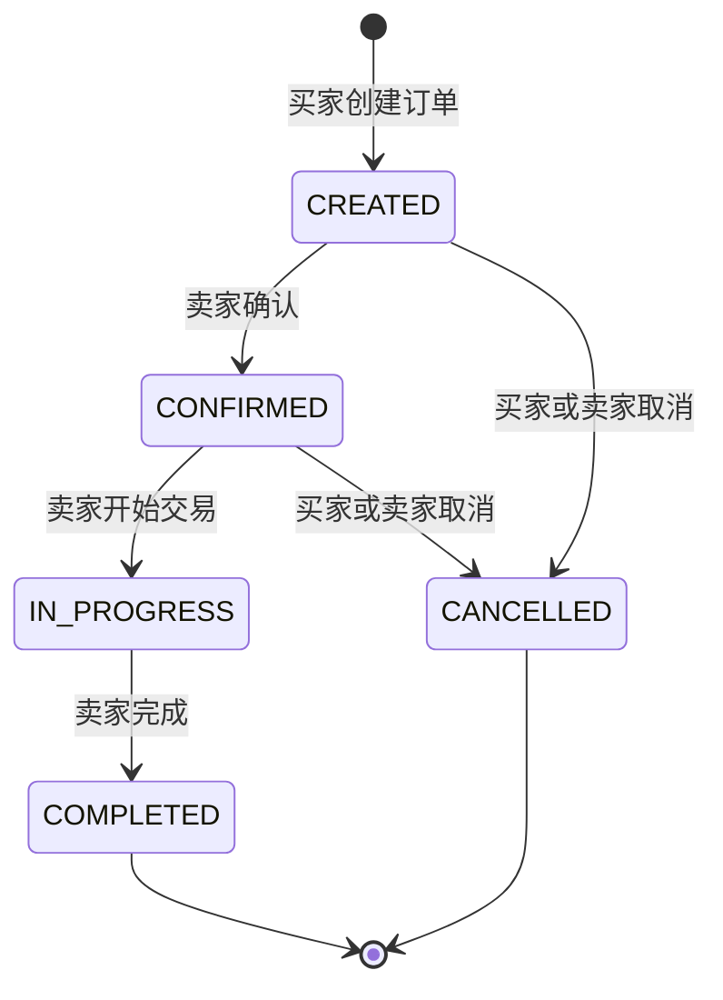
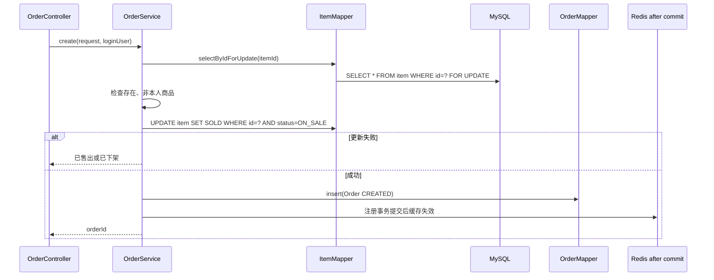

# 订单状态机与并发

## 订单状态



状态中文：

| 状态 | 含义 |
| --- | --- |
| `CREATED` | 待确认 |
| `CONFIRMED` | 已确认 |
| `IN_PROGRESS` | 交易中 |
| `COMPLETED` | 已完成 |
| `CANCELLED` | 已取消 |
| `PAID` | 历史兼容状态，不是当前前端正常流程 |

## 创建订单

入口：`POST /api/orders`



真实代码：

- [`OrderService.create`](https://github.com/DoubleliuOne/campus-ai-market/blob/main/src/main/java/com/campusmarket/service/OrderService.java)
- [`ItemMapper.selectByIdForUpdate`](https://github.com/DoubleliuOne/campus-ai-market/blob/main/src/main/java/com/campusmarket/mapper/ItemMapper.java)

## 并发防超卖

两层保护：

### 第一层：行锁

```sql
SELECT * FROM item WHERE id = ? FOR UPDATE
```

同一商品的并发创建订单会在数据库层串行等待。第二个事务读取时能看到第一个事务提交后的状态。

### 第二层：条件更新

```sql
UPDATE item
SET status = 'SOLD'
WHERE id = ?
  AND status = 'ON_SALE'
```

即使某个流程没有走行锁，条件更新也保证只有第一次状态转换成功，`updated == 1`。

### 为什么两层都保留

- 行锁保护“读取商品数据 -> 创建订单”的整个事务逻辑。
- 条件更新是最终状态门槛，也适合作为防御性代码。
- 数据库唯一约束当前没有覆盖“每件商品只能一个订单”，保护依赖状态转换。

## 状态转换规则

`OrderStatusPolicy.validateTransition` 是纯规则类，不访问数据库：

| 当前状态 | 目标状态 | 谁可以 |
| --- | --- | --- |
| `CREATED` | `CONFIRMED` | 仅卖家 |
| `CREATED` | `CANCELLED` | 买家或卖家 |
| `CONFIRMED` | `IN_PROGRESS` | 仅卖家 |
| `CONFIRMED` | `CANCELLED` | 买家或卖家 |
| `IN_PROGRESS` | `COMPLETED` | 仅卖家 |
| `PAID` | `IN_PROGRESS/COMPLETED` | 仅卖家，历史兼容 |
| `COMPLETED/CANCELLED` | 任意 | 不允许 |

为什么使用状态机：

- 防止买家自行完成任务。
- 防止已取消订单被重新推进。
- 明确每个状态可执行的业务动作。
- 让规则可单元测试。

## 状态更新并发

更新时使用：

```java
orderMapper.update(null, Wrappers.<Order>lambdaUpdate()
        .eq(Order::getId, order.getId())
        .eq(Order::getStatus, order.getStatus())
        .set(Order::getStatus, targetStatus));
```

这等价于：

```sql
UPDATE orders
SET status = ?
WHERE id = ?
  AND status = ?
```

两个用户同时操作时，只有第一个满足旧状态的更新成功，另一个得到“订单状态已发生变化”。

## 取消订单与商品恢复

目标为 `CANCELLED` 时：

```text
订单状态 -> CANCELLED
商品状态 SOLD -> ON_SALE
提交后清商品缓存
```

商品更新同样使用条件 `status='SOLD'`。这防止取消订单时覆盖已经发生的其他异常状态。

这里的事务整体边界由 `@Transactional` 保证：订单状态和商品状态要么一起提交，要么一起回滚。

## 买卖双方权限

### 买家

- 创建订单。
- 查看 buyer 视角订单。
- 在 `CREATED` 或 `CONFIRMED` 取消。
- 不能确认、开始或完成。

### 卖家

- 查看 seller 视角订单。
- 确认、开始交易、完成。
- 在 `CREATED` 或 `CONFIRMED` 取消。
- 不能购买自己的商品。

## 订单查询

`GET /api/orders/my?role=buyer|seller`

先按当前用户和角色分页查询订单，再批量查询：

- 商品标题和图片
- 买家用户名
- 卖家用户名

最终组装 `OrderVO`，数据库只存 id 和价格快照，不重复保存商品标题。

这意味着如果商品后来修改标题，订单页面会显示商品当前标题，而不是下单时标题。当前代码没有保存商品标题快照。价格有快照，标题没有。

## 数据一致性边界

已实现：

- 创建订单和商品变已售在同一事务。
- 取消订单和商品恢复在同一事务。
- 行锁 + 条件更新防并发。
- 状态条件更新防状态覆盖。

未实现：

- 支付超时自动取消。
- 订单超时或延迟消息。
- 真实支付流水。
- 订单操作日志表。
- 数据库唯一约束保证一商品一订单。

## 面试质疑与回答

### 你的订单并发安全吗？

> 正常下单路径有 `SELECT ... FOR UPDATE` 和 `WHERE status='ON_SALE'` 条件更新，能防止两个买家同时把同一商品从在售改为已售。订单状态也用旧状态条件更新避免并发覆盖。还没有数据库级“一商品一订单”约束和支付超时任务。

### 为什么不用乐观锁版本号？

> 商品状态本身就是天然条件，条件更新相当于轻量状态 CAS。创建订单还需要读取价格和卖家并执行多步事务，所以客户端用 `FOR UPDATE` 锁定商品。可以进一步加入 version 字段，但不应重复增加复杂度。

### 为什么取消订单要恢复商品？

> 当前下单即把商品标记为 `SOLD`，表示已被占用。取消后如果订单终态是取消，应释放商品，让其恢复 `ON_SALE`。这保证在无支付系统的情况下仍能继续交易。

### `IN_PROGRESS` 为什么不能取消？

> 当前策略只允许 `CREATED/CONFIRMED` 取消。进入交易中后，代码要求卖家完成订单。现实中应增加争议和仲裁流程，当前项目没有实现。

继续阅读：[图片上传与持久化](./file-upload.md)。
