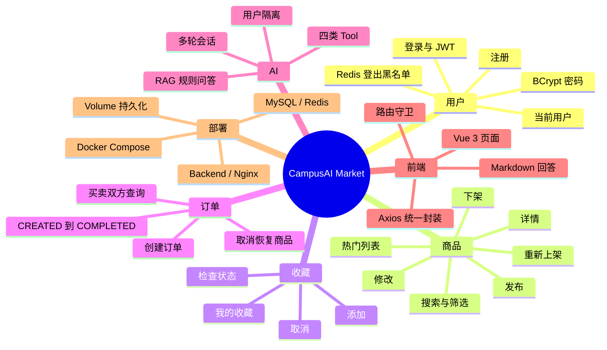
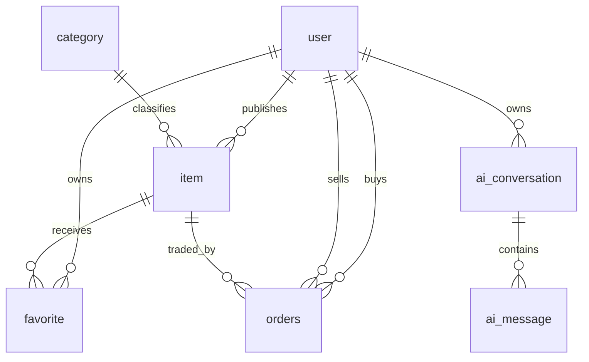

# 项目总览与代码基线

## 一句话定位

CampusAI Market 是一个校园二手交易项目。它用 Spring Boot、MySQL 和 Redis 完成传统交易业务，再通过 Spring AI 把 DeepSeek 接入真实商品、订单与平台规则数据。

它不是“单独做一个聊天框”，而是让模型在需要时调用 Java 后端能力：

- 商品搜索调用 `searchItems`
- 商品详情调用 `getItemDetail`
- 当前用户订单调用 `getMyOrders`
- 推荐商品调用 `recommendItems`
- 平台规则问题使用本地 Embedding 和 `SimpleVectorStore` 检索

## 代码基线

| 项目 | 当前值 |
| --- | --- |
| GitHub | `DoubleliuOne/campus-ai-market` |
| 分支 | `main` |
| 提交 | `b3c73f186b8a81e1fb763eed45a501b06df604ac` |
| 后端 | Java 17 目标版本、Spring Boot 3.5.4 |
| 前端 | Vue 3、Vite 6、Element Plus、Axios |
| 数据库 | MySQL 8、MyBatis-Plus 3.5.9 |
| 缓存 | Redis 7、Spring Data Redis |
| AI | Spring AI 1.1.8、DeepSeek OpenAI 兼容接口、本地 Transformers Embedding |

## 业务范围

## 真实模块入口

| 模块 | 入口 | 核心实现 |
| --- | --- | --- |
| 用户认证 | `AuthController` | `UserService`、`JwtUtil`、`JwtAuthenticationFilter` |
| 商品 | `ItemController` | `ItemService`、`ItemMapper` |
| 收藏 | `FavoriteController` | `FavoriteService` |
| 订单 | `OrderController` | `OrderService`、`OrderStatusPolicy` |
| 图片 | `FileController` | `FileStorageService`、`StorageProperties` |
| AI 对话 | `AgentController` | `AiChatService`、`AgentConversationService` |
| AI Tools | Spring AI 自动注册 | `ItemTools`、`OrderTools` |
| RAG | `AiChatService.buildItemContext` | `KnowledgeBaseService` |

## 核心数据关系

数据库建表在 [`sql/init.sql`](https://github.com/DoubleliuOne/campus-ai-market/blob/main/sql/init.sql)，增量脚本在 [`sql/migrations/V2__phase14_ai_and_order_status.sql`](https://github.com/DoubleliuOne/campus-ai-market/blob/main/sql/migrations/V2__phase14_ai_and_order_status.sql)。

## 技术选择与项目动机

| 技术 | 项目要解决的问题 | 不能替代的事 |
| --- | --- | --- |
| Spring Boot | 快速组织 Web、配置、Bean 和依赖 | 不自动保证业务正确性 |
| Spring Security | 统一无状态鉴权入口 | 不负责 Token 主动失效，需 Redis 黑名单 |
| MyBatis-Plus | 常用 CRUD、分页、条件构造 | 不替代索引和事务设计 |
| Redis | 热点数据加速、黑名单、版本号失效 | 不是永久事实来源 |
| Vue 3 SPA | 用户交互和页面状态管理 | 不负责权限与数据真实性 |
| Tool Calling | 让模型选择并调用后端 Java 能力 | 不保证模型永远选对 Tool |
| RAG | 为规则问题补充私有知识 | 不适合实时订单和价格 |
| Docker Compose | 固化多服务运行环境 | 不等于生产级编排和高可用 |

## README、CONTEXT 与代码的核对结果

| 位置 | 当前描述 | 代码/仓库事实 | 处理 |
| --- | --- | --- | --- |
| `CONTEXT.md`、`NEXT_STEPS.md` | 多处仍写“Phase 14 尚未提交、没有远程仓库” | 当前 HEAD 和 `origin/main` 均为 `b3c73f1` | 教程按当前 Git 状态说明 |
| README | 订单模块称“待确认 → 已确认 → 交易中 → 已完成” | 代码还有 `CANCELLED`，状态机内部兼容历史 `PAID` | 教程列出全部允许转换 |
| README | RAG 描述为 Top 3 | 代码确实使用 `topK(3)` 和 `similarityThresholdAll()` | 保持一致，并说明该阈值含义 |
| README | 图片支持“本地上传和外部 URL” | 上传接口只接收文件；URL 可由商品 DTO 的 `images` 列表兼容保存 | 分开说明 |
| README | 默认从 hf-mirror 下载模型 | `application.properties` 确认为默认值 | 保持一致 |

## 需要明确的工程事实

1. 当前是单体 Spring Boot 应用，不是微服务。
2. `SimpleVectorStore` 是进程内内存向量库，重启后重建。
3. 当前订单没有支付渠道，`PAID` 仅被状态策略兼容，正常新订单从 `CREATED` 开始。
4. Redis 不可用时黑名单、热门缓存和搜索缓存会降级，核心 MySQL 业务仍可继续。
5. 图片默认保存在单机目录，Compose 通过 Volume 持久化，多实例场景需要对象存储。
6. AI 未配置时基础应用仍可启动；AI 接口会返回 `503`。

## 面试中的项目介绍模板

> CampusAI Market 是一个面向校园二手交易的 Spring Boot 项目。传统部分包含用户、商品、收藏和订单状态机；AI 部分通过 Spring AI 接入 DeepSeek Tool Calling，让模型调用真实 Java Service 查询商品和订单，并用本地 Embedding 加 SimpleVectorStore 回答平台规则。项目还包含 Vue 3 前端和 Docker Compose 部署。

这段回答只陈述代码中真实存在的能力。需要在追问时再展开 JWT、Redis、事务和工具调用细节。

继续阅读：[技术栈地图](./tech-stack.md)。
