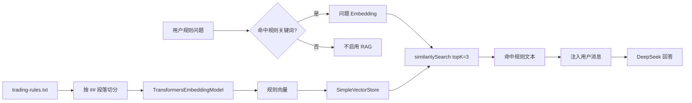

# RAG、Embedding 与向量检索

## RAG 要解决什么

DeepSeek 不知道 CampusAI Market 私有规则，例如项目文档中写明的禁售商品、交易和退款规则。把这些规则每次全塞进 Prompt 会浪费 Token。

RAG 的思路：

```text
先检索与问题相关的规则
-> 只把相关片段加入 Prompt
-> 模型基于片段回答
```

它解决的是“模型缺少外部知识”，不是“模型直接查询实时数据库”。

## 当前项目的完整流程



真实代码：

- [`KnowledgeBaseService.java`](https://github.com/DoubleliuOne/campus-ai-market/blob/main/src/main/java/com/campusmarket/ai/rag/KnowledgeBaseService.java)
- [`RagProperties.java`](https://github.com/DoubleliuOne/campus-ai-market/blob/main/src/main/java/com/campusmarket/ai/rag/RagProperties.java)
- [`trading-rules.txt`](https://github.com/DoubleliuOne/campus-ai-market/blob/main/src/main/resources/knowledge/trading-rules.txt)

## 知识文档

当前 `trading-rules.txt` 有 5 个二级标题段落：

1. 平台禁售规则
2. 可发布商品
3. 发布规范
4. 交易注意事项
5. 退款与售后规则

切分代码：

```java
String[] sections = content.split("\\n(?=## )");
```

每个非空段落成为一个 `Document`，metadata：

```text
source = campus-trading-rules
```

当前没有按固定字符长度递归切分，所以“文本切分”本质上是按规则小节切分。

## Embedding 是什么

Embedding 是把文本映射成高维浮点向量：

```text
"退款规则是什么" -> [0.12, -0.08, 0.51, ...]
"退款与售后规则" -> [0.11, -0.06, 0.49, ...]
```

向量距离近，通常表示语义接近。

为什么需要：

- 同样问题不一定使用相同关键词。
- 字符串相等无法理解“售后”和“退款”。
- 向量空间可以表达更宽的语义相似性。

## 余弦相似度

余弦相似度比较两个向量的夹角：

```text
cos(a, b) = dot(a, b) / (|a| * |b|)
```

- 越接近 1：方向越接近。
- 越接近 0：关系较弱。
- 越接近 -1：方向相反。

`SimpleVectorStore` 在内存中计算查询向量与文档向量的相似度，并排序返回。

## SimpleVectorStore 是什么

它是一个简单的内存向量存储实现：

```java
SimpleVectorStore store = SimpleVectorStore.builder(embeddingModel).build();
store.add(loadRuleDocuments());
```

特点：

- 数据在 JVM 内存。
- 不使用外部向量数据库。
- 适合小规模知识库和演示。
- 重启后需要重新构建。

当前知识库只有 5 段，内存方案足够。若文档达到数万段、要求多实例持久化或权限过滤，应切换 Milvus、pgvector、Elasticsearch 等。

## Top 3 是什么

```java
SearchRequest.builder()
        .query(question)
        .topK(3)
        .similarityThresholdAll()
        .build();
```

`topK(3)` 表示返回相似度排序前 3 个文档。

`similarityThresholdAll()` 让搜索不额外设置最低相似度阈值。结果为空时才返回 `null`。

这带来的风险：即使查询内容与规则关系很弱，也可能返回 3 段规则。当前通过“只有命中规则关键词才启用 RAG”降低无关检索概率。

## 规则关键词门控

关键词包括：

```text
规则、能卖、不能卖、禁、发布、退款、售后、
交易注意、注意、违规、安全、平台
```

只有问题包含关键词才调用 RAG。

这是一种低成本路由：

- 商品搜索问题跳过 Embedding 初始化。
- 只有规则类问题承担模型加载和检索时间。
- 关键词是启发式，不是语义分类器。

## 懒加载与降级

`KnowledgeBaseService` 使用双重检查：

```java
if (initialized) { return vectorStore; }
synchronized (this) { ... }
```

首次有效规则问题才：

1. 创建 `TransformersEmbeddingModel`。
2. 设置模型、tokenizer 和缓存目录。
3. 初始化模型。
4. 创建 `SimpleVectorStore`。
5. 加载规则文档。
6. 保存到 volatile 字段。

任何初始化或检索异常都会被捕获，记录警告后返回 `null`，AI 无规则增强继续回答。

`initialized = true` 即使在失败后也会设置，避免每次请求都会反复下载或初始化失败模型。这一点意味着运行中模型资源恢复后，当前进程不会自动重试初始化。

## 配置

```properties
app.rag.enabled=${RAG_ENABLED:true}
app.rag.model-uri=${EMBEDDING_MODEL_URI:https://hf-mirror.com/.../model.onnx}
app.rag.tokenizer-uri=${EMBEDDING_TOKENIZER_URI:https://hf-mirror.com/.../tokenizer.json}
app.rag.cache-directory=${EMBEDDING_CACHE_DIR:./.model-cache}
```

Docker 映射：

```text
./.model-cache -> /models
EMBEDDING_CACHE_DIR=/models
```

这允许本地已有模型直接挂载，也允许远程下载后缓存。

## 模型与中文限制

当前模型是 `all-MiniLM-L6-v2`：

- 体积小，启动和推理相对方便。
- 对英文训练数据更友好。
- 对中文检索是“可用级别”，不是专门优化。

因此不要声称它是中文语义检索最佳方案。可以评估 BGE 等中文 Embedding，但需要先建立评测集和替换 tokenizer/model。

## 为什么 RAG 能减少胡编

模型最终收到的用户消息类似：

```text
以下是检索到的平台规则知识：
## 退款与售后规则...

用户问题：平台退款规则是什么？
```

System Prompt 还规定必须依据检索内容回答。这样可以减少模型凭空补规则的概率。

但 RAG 不是绝对保证：

- 可能检索错段落。
- 文档本身可能过时。
- 模型仍可能误读。
- `similarityThresholdAll` 可能返回弱相关段落。

生产级系统还需要检索评测、引用来源、阈值调优和答案校验。

## 面试回答

### RAG 是什么？

> RAG 是检索增强生成。项目把交易规则按段落转成向量，存入内存向量库。规则关键词问题触发 Embedding 检索，取 Top 3 相关段落注入 Prompt，再让 DeepSeek 基于规则回答。

### 为什么文本要变成向量？

> 用户问题的词不一定和规则原词完全相同。Embedding 把文本映射到向量空间，余弦相似度可以衡量语义接近程度，比简单关键词匹配更灵活。

### Top 3 怎么理解？

> similaritySearch 对全部文档向量计算相似度并排序，返回得分最高的 3 个 Document。当前没有最低阈值，因此相关性较差时也可能返回 3 段；用规则关键词门控是当前的补偿。

### SimpleVectorStore 有什么局限？

> 它只存在 JVM 内存，重启后重建，不天然支持多实例共享和大规模索引。当前 5 段规则很适合它，但业务扩大后应换持久化向量数据库。

### 本地 Embedding 有什么优缺点？

> 优点是不把文档发送给第三方、没有额外 Embedding API 成本，容器可离线使用。缺点是模型文件、内存和首次加载成本由自己承担，当前中文效果也有限。

继续阅读：[Agent 与 RAG 对比](./agent-vs-rag.md)。
