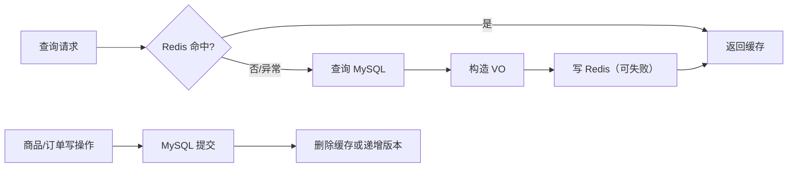

# Redis 缓存与失效

## Redis 在项目中存什么

| 用途 | Key | Value | TTL | 写入 | 读取 | 删除/失效 |
| --- | --- | --- | --- | --- | --- | --- |
| JWT 黑名单 | `auth:blacklist:v2:<sha256>` | `1` | Token 剩余秒数 | 登出 | 每次 JWT Filter | TTL 到期 |
| 热门商品 | `cache:item:hot` | `List<ItemVO>` JSON | 300 秒 | 热门列表缓存未命中 | `GET /api/items/hot` | 商品写操作删除 |
| 搜索版本 | `cache:item:search:v1:version` | 整数 | 无项目内显式 TTL | 首次初始化或写操作递增 | 构造搜索 Key | 不主动删除 |
| 搜索结果 | `cache:item:search:v1:<version>:<hash>` | `PageResult<ItemVO>` JSON | 90 秒 | 搜索缓存未命中 | 搜索请求 | 靠版本切换和 TTL |

## Redis 与 MySQL 的职责划分



MySQL 是事实来源；Redis 只是可丢失的加速层和临时状态层。

## 热门缓存

### 读

`ItemService.getHotItems`：

1. 读取 `cache:item:hot`。
2. JSON 能反序列化就直接返回。
3. 异常或未命中时查 MySQL。
4. 写回 Redis 300 秒。

### 写

商品发布、修改、下架、重新上架、下单和取消订单都会触发缓存处理。

普通 Service 直接调用 `evictItemCaches()`。订单事务中使用 `evictItemCachesAfterCommit()`，确保事务提交后才失效。

## 搜索缓存

### Key 规范化

条件按固定顺序拼接：

```text
keyword|categoryId|minPrice|maxPrice|sort|page|size
```

关键词转小写，价格去除无意义尾零，最后 SHA-256。

### 版本初始化

`currentSearchCacheVersion()`：

1. 先读版本。
2. 不存在时用 `SETNX` 尝试写 `0`。
3. SETNX 成功则返回 `0`。
4. SETNX 失败说明其他请求已初始化，再次读取。
5. Redis 异常时返回本地 fallback `0`。

### 写后失效

```java
redisTemplate.opsForValue().increment(SEARCH_CACHE_VERSION_KEY);
```

递增后所有新请求都使用新版本。旧搜索结果不被新请求访问，并在 90 秒内自动过期。

## 为什么订单事务要提交后再清缓存

如果事务内先清缓存，随后数据库事务回滚：

```text
缓存已清 -> 其他请求查不到缓存 -> 去 MySQL 读到旧数据并重新缓存
事务随后回滚 -> 数据没有变化
```

虽然结果可能仍正确，但会造成不必要的缓存重建。更严重的情况是清缓存时数据库尚未提交，其他线程重新查询并缓存旧值。`afterCommit` 将缓存失效与成功提交绑定。

## Redis 不可用时的行为

### JWT 黑名单

Filter 捕获异常后继续执行 JWT 验签。已登出 Token 在黑名单不可用期间可能重新有效。

### 热门和搜索缓存

读异常直接回退 MySQL。写异常被忽略，业务继续，因为 TTL 最终会清理旧缓存。搜索版本异常时使用固定版本 Key，仍有 90 秒 TTL。

## 缓存穿透

**定义**：查询数据库中不存在的数据，缓存无法命中，每次都穿透到数据库。

**当前项目风险**：

- 商品搜索缓存只缓存成功查询结果。
- 搜索不存在的关键词会得到空 `records`，但 `PageResult` 仍会被缓存 90 秒，所以重复同条件查询可命中空结果。
- 随机不重复关键词仍可穿透。

**当前是否解决**：部分缓解，没有系统性的布隆过滤器或空值保护。

## 缓存击穿

**定义**：某个热点 Key 过期时，大量并发请求同时查数据库。

**当前项目风险**：

- `cache:item:hot` 是热点 Key。
- 代码没有互斥锁或逻辑过期。
- 商品写操作会主动删除，随后并发请求可能同时重建。

**结论**：存在风险，但当前单机校园项目数据量小，影响有限。

## 缓存雪崩

**定义**：大量 Key 同时失效，数据库瞬时压力升高。

**当前项目风险**：

- 搜索 Key 由每次请求写入，过期时间天然分散。
- 热门 Key 只有一个，不存在大量 Key 同秒过期。
- 版本切换会使旧版本整体不可用，但没有批量预生成。

**结论**：项目级“大面积雪崩”风险不高；热门 Key 击穿更贴近现实。

## 数据一致性

当前策略是：

```text
先写 MySQL
-> 成功后删除热门缓存 / 递增搜索版本
-> 旧搜索缓存 TTL 过期
```

它是一种 cache-aside 模式，能避免数据库和缓存双写顺序问题。

潜在窗口：

- 更新数据库后、缓存失效前，旧热缓存最多可读到极短时间。
- Redis 失效命令失败时依赖 TTL。
- Redis 版本 Key 被误删会回到低版本，理论上可能重新读到未过期的旧 Key。

## 如果改善

| 问题 | 可选方案 | 代价 |
| --- | --- | --- |
| 热点 Key 击穿 | 互斥重建、逻辑过期 | 增加复杂度 |
| 查询穿透 | 空值缓存、布隆过滤器 | 数据变化管理 |
| 多实例 | Redis 版本失效仍可用 | 本地缓存需额外同步 |
| 缓存异常 | 高可用 Redis、监控 | 运维成本 |
| 强一致 | 缩短 TTL、读后校验 | 增加数据库压力 |

## 面试回答

### 为什么使用 Redis？

> 项目有三类场景：登出 Token 需要短时黑名单，热门商品有热点读，Agent 与首页会重复搜索相同条件。Redis 适合这些临时和低延迟数据。它不保存用户或订单事实，Redis 故障时可降级到 MySQL，代价是黑名单暂时失效。

### 缓存失效怎么办？

> 商品写操作成功后删除热门缓存并递增搜索缓存版本。订单事务在 `afterCommit` 后处理，避免未提交时重建缓存。旧搜索结果靠 90 秒 TTL 自动清理。

### 有没有缓存三大问题？

> 项目没有使用布隆过滤器，随机不存在关键词仍可能穿透；热门 Key 失效也没有互斥锁，存在击穿风险；当前 Key 数量和过期时间较分散，雪崩不是主要问题。面试时要如实说明当前规模与风险，而不是硬说全部解决。

继续阅读：[订单状态机与并发](./order-system.md)。
