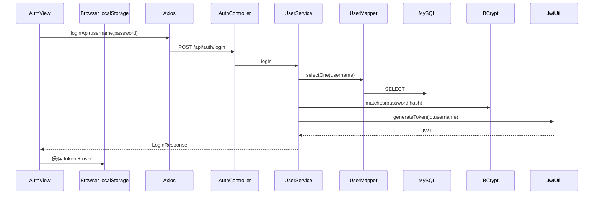
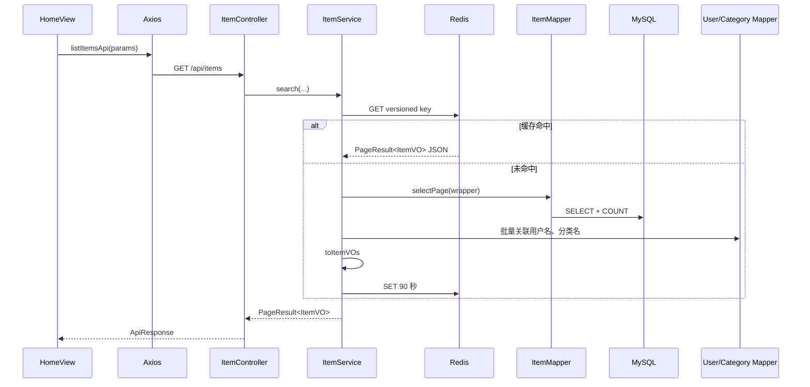
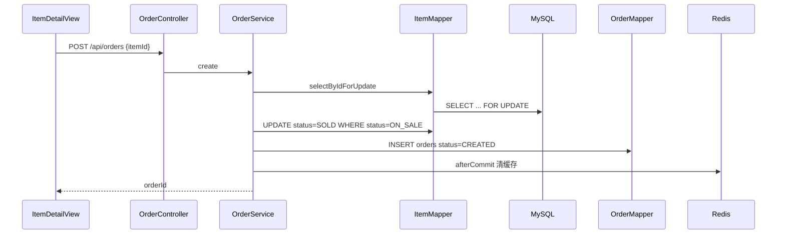
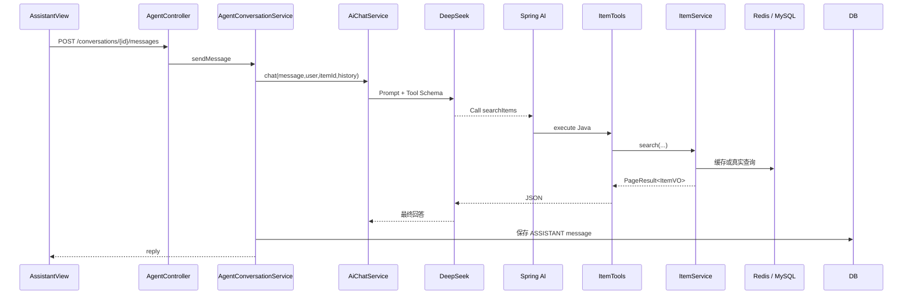
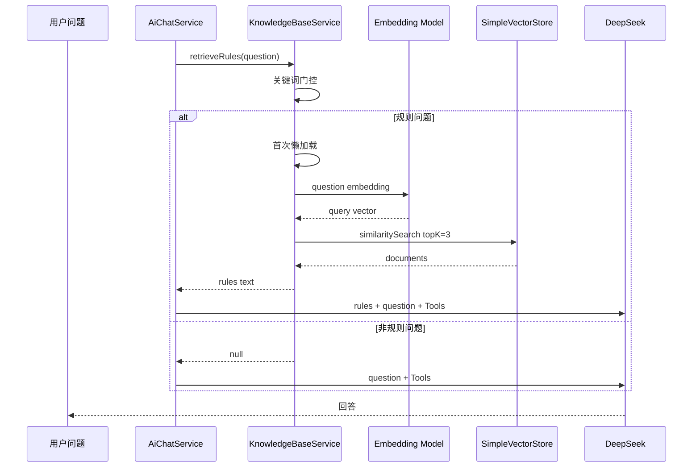
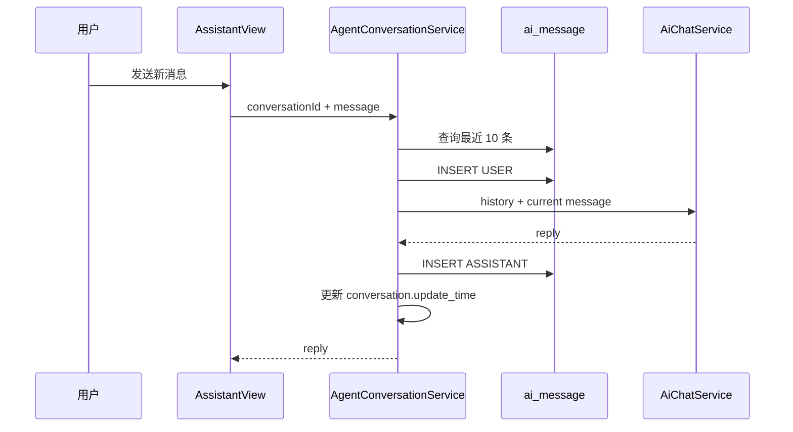

# 六大完整业务链路

本章把最重要的业务从 Vue 追到数据层。阅读时建议同时打开对应源码。

## 链路 1：登录



关键文件：

```text
frontend/src/views/AuthView.vue
frontend/src/stores/auth.js
frontend/src/api/http.js
src/main/java/com/campusmarket/controller/AuthController.java
src/main/java/com/campusmarket/service/UserService.java
src/main/java/com/campusmarket/security/JwtUtil.java
```

回答重点：

- 密码数据库哈希。
- 用户名查询失败和密码错误合并。
- JWT 包含用户 id 和 username。
- 前端只负责保存和后续携带。

## 链路 2：商品查询



关键文件：

```text
frontend/src/views/HomeView.vue
frontend/src/api/index.js
src/main/java/com/campusmarket/controller/ItemController.java
src/main/java/com/campusmarket/service/ItemService.java
src/main/java/com/campusmarket/mapper/ItemMapper.java
```

回答重点：

- 只查 `ON_SALE`。
- 条件构造器控制动态筛选。
- MyBatis-Plus 分页。
- VO 合并卖家和分类。
- Redis 缓存版本化。

## 链路 3：创建订单



关键文件：

```text
frontend/src/views/ItemDetailView.vue
src/main/java/com/campusmarket/controller/OrderController.java
src/main/java/com/campusmarket/service/OrderService.java
src/main/java/com/campusmarket/mapper/ItemMapper.java
src/main/java/com/campusmarket/entity/Order.java
```

回答重点：

- 本人不能购买自己的商品。
- 行锁 + 条件更新。
- 商品和订单在同一事务。
- 订单保存价格与卖家快照。

## 链路 4：AI 商品搜索



回答重点：

- 模型只生成工具调用。
- Spring AI 执行 Java。
- 用户身份来自 ToolContext。
- 搜索复用普通商品缓存。
- ToolCallBudget 最多 6 次。

## 链路 5：RAG



回答重点：

- 规则文档按 `##` 切分。
- 只有规则关键词命中才检索。
- 初始化失败自动跳过 RAG。
- `SimpleVectorStore` 是内存实现。

## 链路 6：AI 多轮会话



回答重点：

- conversation 负责会话，message 负责消息。
- 最近 10 条控制上下文。
- 单条和总量还有字符限制。
- 所有访问都检查 `user_id`。
- AI 失败时删除已保存用户消息。

## 一条请求经过的横向能力

每个受保护请求还会经过：

```text
CallLoggingAspect
  -> 记录方法、参数摘要、耗时和异常

GlobalExceptionHandler
  -> 把业务或框架异常转成统一响应

Security
  -> 校验 JWT 并写入 LoginUser
```

面试回答不要只讲“理想 Controller -> Service -> Mapper”，还要知道横切能力在什么时候介入。

下一步使用 [核心源码地图](./source-map.md) 做闭卷复述。
