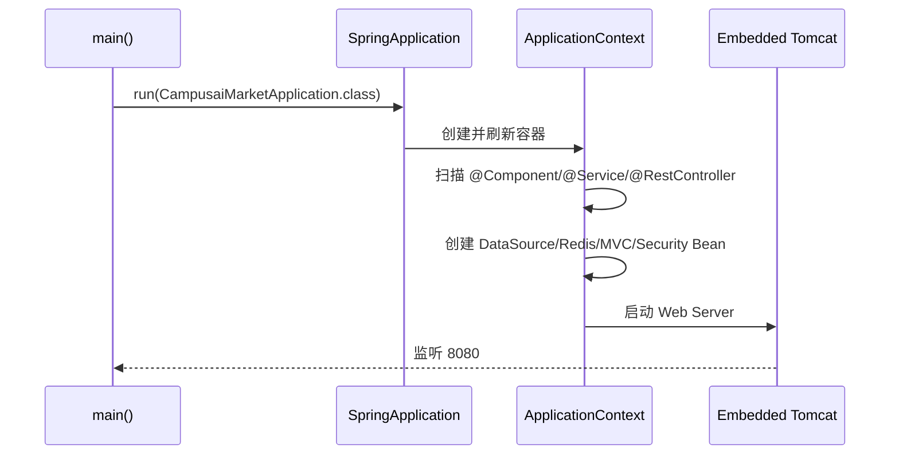
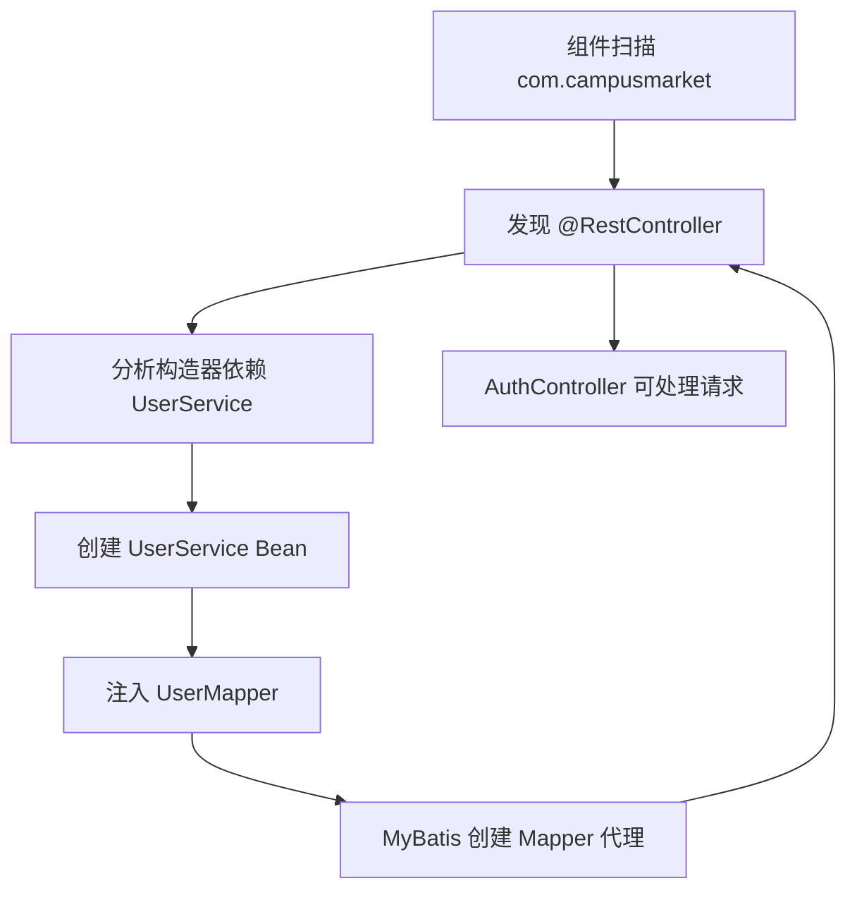

# Spring Boot 从零到项目

## Spring Boot 是什么

Spring Boot 是在 Spring Framework 之上提供自动配置、依赖管理、内嵌服务器和生产运行能力的框架。它让你用较少配置启动一个可运行的 Java Web 应用。

在本项目中，Spring Boot 做四件关键事：

1. 通过 Maven Starter 统一 Web、Security、Redis、Validation 和测试依赖。
2. 启动内嵌 Tomcat 并提供 HTTP 服务。
3. 扫描 `com.campusmarket` 下的 Bean。
4. 根据依赖和配置自动创建 MVC、Security、DataSource、Redis、Jackson、MyBatis-Plus 等基础设施。

## 项目启动入口

```java
@SpringBootApplication(exclude = UserDetailsServiceAutoConfiguration.class)
public class CampusaiMarketApplication {
    public static void main(String[] args) {
        SpringApplication.run(CampusaiMarketApplication.class, args);
    }
}
```

真实路径：

[`CampusaiMarketApplication.java`](https://github.com/DoubleliuOne/campus-ai-market/blob/main/src/main/java/com/campusmarket/CampusaiMarketApplication.java)

### 为什么排除 `UserDetailsServiceAutoConfiguration`

项目自己使用 JWT，不采用 Spring Security 默认的内存用户和默认 `UserDetailsService`。排除默认自动配置可以避免启动时生成无关默认密码和用户。

这不是“禁用 Security”，`SecurityConfig` 仍然定义完整过滤链。

## 启动流程



常见启动日志标志：

```text
Tomcat started on port 8080
Started CampusaiMarketApplication
```

## 自动配置是什么

自动配置是 Spring Boot 根据 classpath、已定义 Bean 和配置文件决定“默认需要创建什么”。

项目里的具体体现：

| 自动配置 | 触发条件 | 项目结果 |
| --- | --- | --- |
| Web MVC | 使用 `spring-boot-starter-web` | 扫描 Controller，注册 Jackson |
| Security | 使用 Security Starter | 创建 Security 过滤链 |
| DataSource | 存在 MySQL 驱动和 datasource 配置 | 创建连接池 |
| Redis | 使用 Data Redis Starter | 创建 Lettuce 连接和 `StringRedisTemplate` |
| Validation | 使用 Validation Starter | 让 `@Valid` 生效 |
| MyBatis-Plus | 使用 Starter | 扫描 `@Mapper` 并创建 Mapper Bean |

自动配置不是绕过手写代码。项目仍然自定义：

- `SecurityConfig`：覆盖默认 HTTP Security
- `MybatisPlusConfig`：注册分页拦截器
- `AppConfig`：注册 BCrypt
- `StorageProperties`：绑定 `app.storage`

## Bean、IOC 和 DI

### Bean

Bean 是由 Spring 容器创建和管理的对象。项目中的例子：

- `@RestController` 的 `AuthController`
- `@Service` 的 `UserService`
- `@Component` 的 `JwtUtil`
- `@Bean` 方法返回的 `PasswordEncoder`

### IOC

IOC 是控制反转：对象不由业务代码用 `new UserService(...)` 手动创建，而由 Spring 创建并管理生命周期。

### DI

DI 是依赖注入。项目采用构造器注入，例如 `AuthController`：

```java
private final UserService userService;

public AuthController(UserService userService) {
    this.userService = userService;
}
```

构造器注入的优点：

- 依赖不可为空。
- 依赖关系清晰。
- 更容易编写单元测试。
- 避免字段注入带来的隐藏依赖。

## 一个 Controller Bean 如何被创建



这说明 Controller 看起来只有一个字段，背后可能牵动整条依赖链。

## 配置的层次

| 配置 | 用途 |
| --- | --- |
| `application.properties` | 通用非敏感默认配置 |
| `application-docker.yml` | Docker Profile 配置，读取环境变量 |
| `src/main/resources/application.yml` | 本地忽略文件，仓库不提供真实值 |
| `.env.example` | 部署时需要的环境变量模板 |

`application-docker.yml` 使用：

```yaml
spring:
  profiles:
    active: docker
```

实际由 Compose 注入 `SPRING_PROFILES_ACTIVE=docker`。

## 项目中的 AOP

`spring-boot-starter-aop` 让 `CallLoggingAspect` 生效：

```text
Controller/Service 调用
  -> Around Advice 开始计时
  -> 执行真实方法
  -> 成功或异常后写日志
```

AOP 适合日志、事务、权限等横切关注点。项目中的 `@Transactional` 本质上也是代理机制参与工作。

## Bean Validation

Controller 参数使用 `@Valid`，DTO 使用 `@NotBlank`、`@Size`、`@Positive` 等注解。校验失败会被 `GlobalExceptionHandler` 转换为统一 400 响应。

示例：

```text
POST /api/auth/register
  -> @Valid RegisterRequest
  -> username 为空
  -> MethodArgumentNotValidException
  -> GlobalExceptionHandler
  -> {code: 400, message: "username: 用户名不能为空"}
```

## 为什么事务依赖 Spring 代理

`OrderService.create` 和 `updateStatus` 使用 `@Transactional`。外部调用先经过 Spring 生成的代理：

```text
Controller -> OrderService 代理
             -> 开启事务
             -> 执行真实方法
             -> 提交或回滚
```

因此不要在一个 Service 类内部直接调用自己的事务方法，并误以为一定开启新事务；那属于自调用代理问题。

## 面试回答

### Spring Boot 是什么？

> 它不是替代 Spring，而是在 Spring 上提供自动配置、Starter 依赖和内嵌服务器。项目用它启动 Spring MVC、Security、MyBatis-Plus、Redis 和 AI 组件，业务代码仍按 Controller、Service、Mapper 分层。

### 项目里 IOC 和 DI 在哪里？

> 例如 `AuthController` 的构造器接收 `UserService`，`UserService` 又接收 Mapper、PasswordEncoder 和 JwtUtil，全部由 Spring 创建和注入。我们在业务代码里不手动 new 这些组件。

### 自动配置和自定义配置冲突吗？

> 不冲突。Spring Boot 先提供默认 Bean，项目可以定义自己的 `SecurityFilterChain` 或 MyBatis 拦截器覆盖默认行为。自动配置通常还受 `@ConditionalOnMissingBean` 等条件控制。

继续阅读：[Controller / Service / Mapper 分层](./backend-layers.md)。
