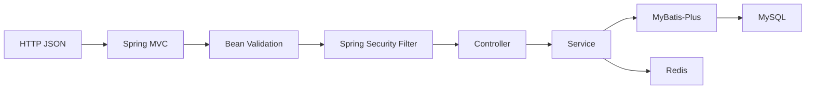
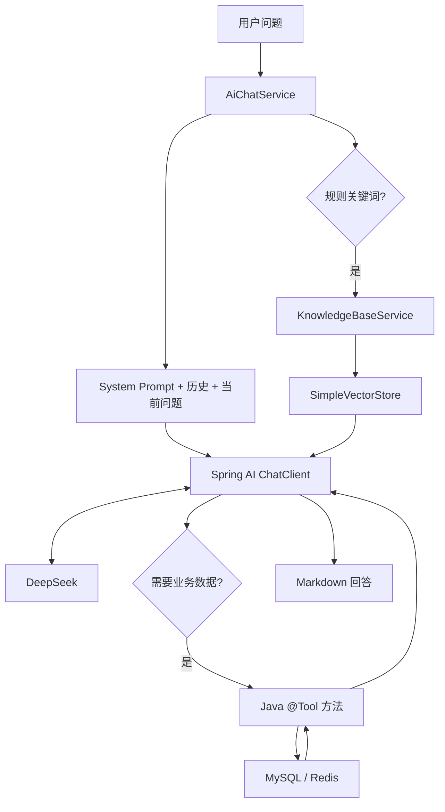

# 技术栈地图

技术栈不是版本清单。下面每项都对应到真实代码职责。

## 总表

| 技术 | 项目中的具体位置 | 为什么使用 | 解决什么问题 |
| --- | --- | --- | --- |
| Java 17 | `pom.xml` 的 `java.version` | 使用现代语言能力，同时保持较常见面试基线 | 统一编译目标与运行特性 |
| Spring Boot 3.5.4 | `pom.xml`、`CampusaiMarketApplication` | 管理依赖、自动配置和启动 | 降低 Web 应用装配成本 |
| Spring MVC | Controller 包注解 | 提供 REST 路由、参数绑定和 JSON 序列化 | HTTP 接口层 |
| Spring Security | `SecurityConfig`、`JwtAuthenticationFilter` | 无状态安全过滤链 | JWT 鉴权与公开/受保护路由 |
| MyBatis-Plus | Mapper 包、`MybatisPlusConfig` | 简化 CRUD、条件查询和分页 | 减少重复 SQL |
| MySQL 8 | `sql/init.sql` | 持久化用户、商品、订单和会话 | 可靠性数据存储 |
| Redis 7 | `TokenBlacklistService`、`ItemService` | 黑名单、热门缓存、搜索缓存版本 | 低延迟状态和短时缓存 |
| JWT | `JwtUtil` | 无状态身份凭证 | 服务端不保存 Session |
| BCrypt | `AppConfig.passwordEncoder` | 单向哈希并带随机盐 | 防止明文密码落库 |
| Vue 3 | `frontend/src` | 构建 SPA 页面 | 商品、订单、AI 交互 |
| Vite | `frontend/vite.config.js` | 开发代理与生产打包 | 本地开发和生产资源优化 |
| Vue Router | `frontend/src/router/index.js` | 页面路由、懒加载和守卫 | 登录页面与受保护页面切换 |
| Element Plus | `frontend/src/main.js`、各页面 | 表单、按钮、分页、标签页 | 通用交互组件 |
| Axios | `frontend/src/api/http.js` | 统一 Base URL、Token 和错误处理 | 前端 API 请求层 |
| Spring AI 1.1.8 | `pom.xml`、`AiChatService` | Tool 注册、ChatClient 和向量检索抽象 | 将模型接入 Java 业务 |
| DeepSeek | `application-docker.yml` | OpenAI 兼容 Chat 模型 | 自然语言理解与回答生成 |
| Tool Calling | `ItemTools`、`OrderTools` | 模型生成工具调用请求 | 查询真实业务数据 |
| Agent | `AiChatService` 的 ChatClient 循环 | 让模型判断是否使用工具 | 多步骤问题处理 |
| RAG | `KnowledgeBaseService` | 检索平台规则文本 | 补充模型不具备的私有知识 |
| Embedding | `TransformersEmbeddingModel` | 将文本编码为向量 | 语义相似度检索 |
| SimpleVectorStore | `KnowledgeBaseService` | 进程内向量检索 | 小规模规则知识库 |
| Docker | `backend.Dockerfile`、`frontend/Dockerfile` | 固化构建与运行环境 | 提高部署一致性 |
| Docker Compose | `docker-compose.yml` | 编排 MySQL、Redis、后端和前端 | 一键启动完整栈 |
| Nginx | `frontend/nginx.conf` | 静态资源托管和反向代理 | SPA fallback 与 `/api` 转发 |
| Swagger / OpenAPI | `OpenApiConfig`、SpringDoc | 自动生成接口文档 | 接口调试与契约说明 |

## 后端请求技术链

## 数据侧职责

### MySQL

MySQL 是事实来源：

- 用户密码哈希
- 商品当前状态和价格
- 收藏关系
- 订单当前状态和价格快照
- AI 会话与消息

### Redis

Redis 不是业务事实来源：

- `auth:blacklist:v2:<sha256>`：登出后的 JWT 黑名单
- `cache:item:hot`：热门商品列表
- `cache:item:search:v1:version`：搜索缓存版本号
- `cache:item:search:v1:<version>:<sha256>`：搜索结果

Redis 故障时，代码会回退 MySQL 或允许短时间失去黑名单能力。

## AI 技术链

## 每个技术的项目回答模板

### Spring Boot

> 项目用 `@SpringBootApplication` 启动，Controller、Service、Mapper 和配置类由组件扫描注册为 Bean，依赖通过构造器注入。`application.properties` 与 `application-docker.yml` 分别提供本地默认配置和 Docker Profile 配置。

### MyBatis-Plus

> 每个 Mapper 继承 `BaseMapper`，普通 CRUD 和条件查询由 MyBatis-Plus 生成，分页依赖 `MybatisPlusConfig` 注册的 `PaginationInnerInterceptor`。商品创建订单时还有自定义 `SELECT ... FOR UPDATE`。

### Redis

> Redis 在项目中负责登出黑名单、热门商品缓存和搜索缓存。写商品、下架、重新上架、下单和取消订单都会清缓存或递增版本号。Redis 不可用时业务降级到 MySQL。

### Spring AI / DeepSeek

> `ChatClient.Builder` 注册了 `ItemTools` 和 `OrderTools`。模型通过 Tool Calling 生成工具名和参数，Spring AI 负责匹配 Java 方法并执行，结果再回到模型生成最终回答。

### Vue

> Vue 3 页面通过 `frontend/src/api/index.js` 调用后端，Axios 拦截器自动附带 JWT，并在 401 时清理会话。AI 页面用 `marked + DOMPurify` 安全渲染 Markdown。

## 易错点

- 不要把 Redis 说成用户和商品的唯一存储。
- 不要说 AI 能“直接执行 Java”；它只生成 Tool Call，执行发生在 Spring AI 和 Java 方法中。
- 不要夸大 RAG 检索规模；当前知识库只有 5 个规则段落。
- 不要声称 Docker Compose 已具备高可用；它只是单机多容器编排。
- 不要把 Vue 前端隐藏按钮当作权限控制；真正的权限检查在 Service 和 Security。

下一步阅读：[系统整体架构](./architecture.md)。
