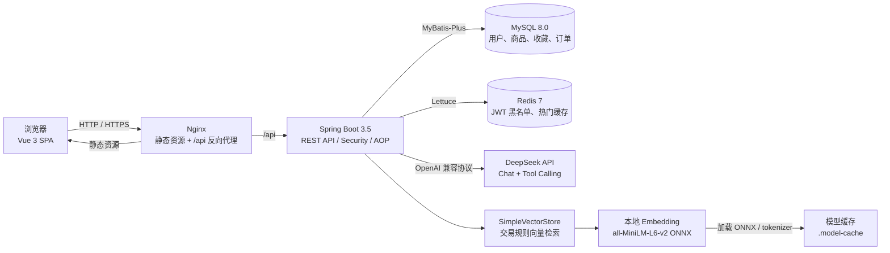

# CampusAI Market 系统架构

## 关键链路

1. 本地开发时由 Vite 将 `/api` 代理到 Spring Boot；Docker Compose 中由 Nginx 反向代理。
2. 登录成功后签发 JWT，后续受保护接口通过 `Authorization: Bearer <token>` 鉴权。
3. 登出 token 写入 Redis 黑名单；热门商品列表使用 Redis 缓存，Redis 不可用时业务自动降级。
4. AI 请求通过 DeepSeek Tool Calling 调用真实 Java 方法查询 MySQL；交易规则问题使用本地 Embedding 在 `SimpleVectorStore` 中检索后注入上下文。
5. Docker 环境可把 `.model-cache` 只读挂载到 `/models`，避免容器运行时下载模型。

[返回 README](../README.md)
