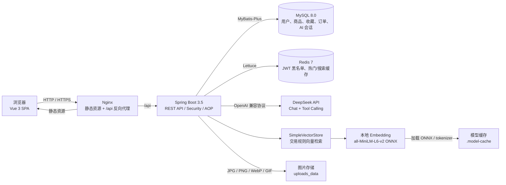

# CampusAI Market 系统架构

## 关键链路

1. 本地开发时由 Vite 将 `/api` 代理到 Spring Boot；Docker Compose 中由 Nginx 反向代理。
2. 登录成功后签发 JWT，后续受保护接口通过 `Authorization: Bearer <token>` 鉴权。
3. 登出 token 以 SHA-256 摘要写入 Redis 黑名单；热门商品和 Agent 搜索使用 Redis 缓存，Redis 不可用时业务自动降级。
4. 商品写操作通过缓存版本号使旧搜索结果失效，避免新增、修改、下架、重新上架和订单取消后读到脏数据。
5. AI 请求通过 DeepSeek Tool Calling 调用真实 Java 方法查询 MySQL；交易规则问题使用本地 Embedding 在 `SimpleVectorStore` 中检索后注入上下文。RAG 在首次规则提问时懒加载，模型不可用时自动跳过规则增强而不影响主服务启动。
6. AI 会话与消息保存在 MySQL，只加载当前用户最近 10 条消息用于多轮理解，并提供历史会话查询。
7. Docker 环境把 `.model-cache` 挂载到 `/models` 并保持可写，既复用本地模型，也允许首次运行时缓存远程模型；上传目录挂载到 `uploads_data` 持久化。

[返回 README](../README.md)
