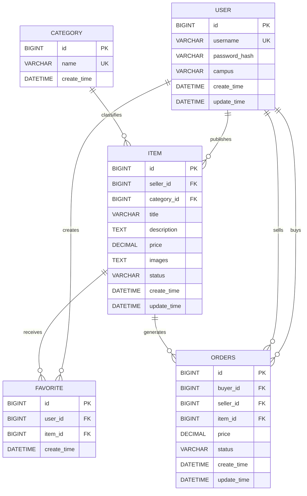

# CampusAI Market ER 图

## 状态说明

- `item.status`：`ON_SALE`、`SOLD`、`OFF_SHELF`
- `orders.status`：`CREATED`、`PAID`、`COMPLETED`、`CANCELLED`
- `favorite` 对 `(user_id, item_id)` 建立唯一约束，防止重复收藏。
- 金额字段使用 `DECIMAL(10,2)`，订单中的 `price` 是下单时的价格快照。

[返回 README](../README.md)
